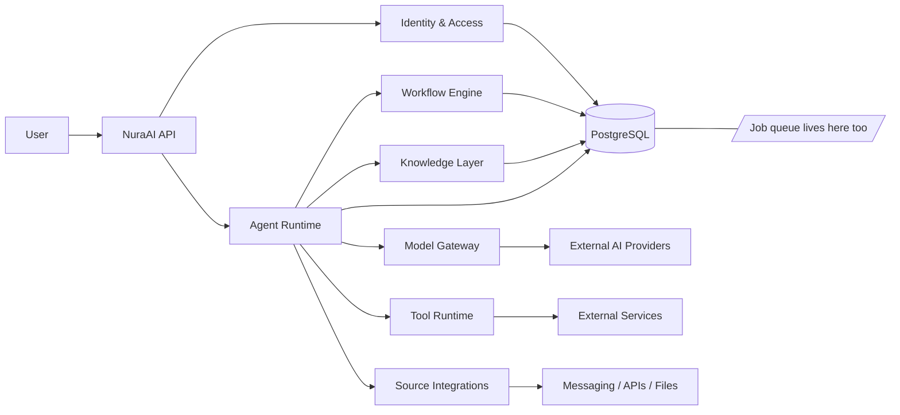

# NuraAI

NuraAI is a multi-tenant AI orchestration platform for teams that need secure, governed, and extensible agent-based workflows.

It brings together:

- users and team membership
- AI agents and model orchestration
- permissions and access control
- knowledge retrieval
- external source integrations
- tools and automation workflows

## Mission

NuraAI aims to make AI usable in real organizational workflows without sacrificing governance, safety, or traceability.

**For any past run, answer exactly what instructions caused it.**

An agent that acts on your behalf is only as trustworthy as your ability to reconstruct why it acted. A run's own account of itself does not count — a successful injection can make an agent misreport what it did — so the record is written by the runtime from the actual execution path, not from the model's narration.

Four things make that answerable rather than aspirational: every run pins the resolved configuration that produced it, workflow versions are immutable so an edit cannot change a run already in flight, every tool call is recorded before it executes and includes the ones that were denied, and the audit log is a transactional write that is never sampled.

## Core Concepts

- User: the canonical identity of a human person.
- Team: the collaboration boundary for a group of users and resources.
- Agent: the operational AI worker that executes tasks.
- Model: the underlying capability abstraction for the chosen AI provider.
- Source: the external channel or integration through which data enters or leaves the system.
- Tool: an executable capability available to agents and workflows.
- Permission: the explicit authorization model for actions and resources.
- Knowledge: the context available to agents during execution.
- Workflow: automation logic that orchestrates triggers, steps, and outputs.

## Architecture at a Glance



## Documentation Index

- [docs/01-user.md](docs/01-user.md) — User identity and ownership model
- [docs/02-team.md](docs/02-team.md) — Team collaboration boundary
- [docs/03-agent.md](docs/03-agent.md) — Agent runtime and responsibilities
- [docs/04-model.md](docs/04-model.md) — Model abstraction and capability metadata
- [docs/05-source.md](docs/05-source.md) — External data and channel integrations
- [docs/06-tool.md](docs/06-tool.md) — Safe tool execution model
- [docs/07-permission.md](docs/07-permission.md) — Role and access control model
- [docs/08-knowledge.md](docs/08-knowledge.md) — Knowledge retrieval and context management
- [docs/09-workflow.md](docs/09-workflow.md) — Automated execution flows
- [docs/10-architecture.md](docs/10-architecture.md) — High-level system architecture
- [docs/11-runtime.md](docs/11-runtime.md) — Execution lifecycle and runtime flows
- [docs/12-security.md](docs/12-security.md) — Security model and governance
- [docs/13-roadmap.md](docs/13-roadmap.md) — Delivery and engineering roadmap
- [docs/14-database.md](docs/14-database.md) — Relational schema reference and rationale
- [docs/15-api.md](docs/15-api.md) — REST API surface and contracts
- [docs/16-backend-architecture.md](docs/16-backend-architecture.md) — Backend structure and service breakdown
- [docs/17-threat-model.md](docs/17-threat-model.md) — Prompt injection, confused deputy, and the trust model
- [docs/18-production-checklist.md](docs/18-production-checklist.md) — Production readiness gates and risk areas
- [docs/19-tech-stack.md](docs/19-tech-stack.md) — Stack decisions, environment contract, and nginx boundary
- [docs/20-authentication.md](docs/20-authentication.md) — Wallet sign-in and token design
- [docs/21-testing.md](docs/21-testing.md) — Testing strategy, security suites, and evals
- [docs/22-observability.md](docs/22-observability.md) — Logs, metrics, traces, alerts, and SLOs
- [docs/23-job-queue.md](docs/23-job-queue.md) — Database-backed queue, leases, and scheduling
- [docs/24-ui-standards.md](docs/24-ui-standards.md) — Design system, the quarantine primitive, RTL, and accessibility
- [docs/25-ui-information.md](docs/25-ui-information.md) — Screens, what each must show, and the security-critical views
- [docs/26-runbook.md](docs/26-runbook.md) — Incident triage procedures for observability and security pages

## Stack

| Layer    | Choice                                                              |
| -------- | ------------------------------------------------------------------- |
| Backend  | Fastify + TypeScript                                                |
| Frontend | React + Vite + TailwindCSS                                          |
| Database | PostgreSQL — the only supported engine; PGlite in-process for tests |
| Schema   | Drizzle, defined in code — no hand-written SQL in this repository   |
| Auth     | JWT issued after EVM wallet sign-in (EIP-4361 / SIWE)               |
| i18n     | react-i18next — English and Persian, RTL                            |
| Queue    | A table in the same database — no broker, no Redis                  |

**TLS and CORS are handled by nginx and are not implemented here.** See [docs/19-tech-stack.md](docs/19-tech-stack.md) for the full boundary and the environment contract.

## Production commands

The supported deployment here keeps PostgreSQL, the API, and the background worker on the same host. The worker includes scheduling and lease reaping; it is a separate process from the API. The optional [Linux systemd + nginx templates](#linux-systemd--nginx-templates) below select systemd as the process manager for this topology. Repository scripts do not install software, register OS services, or deploy; template installation and every migration remain explicit operator actions.

With the locked dependencies already installed, run the release gate from the repository root:

```bash
npm run release:check
```

This checks formatting, lint, API source and dedicated test typechecks, web typecheck, both builds, static deployment contracts (`npm run test:deploy`, using only Node's built-in test runner), and all application tests. It then copies the compiled API to a disposable directory and applies its packaged SQL migrations and journal to in-memory PGlite, checks every compiled schema table, and replays migrations to verify idempotence. No production environment, external database, or listening service is needed. It is not a substitute for PostgreSQL backup/restore or operational readiness checks.

The API build cleans only `apps/api/dist`, excludes test files and standalone test helpers, and copies SQL migrations plus metadata into `dist/db/migrations`. Migration paths resolve relative to the module, not the working directory, in both source and compiled execution. Keep `apps/api/production.mjs`, `apps/api/package.json`, `apps/api/dist`, and the locked production dependency tree together; `dist` alone is not a dependency bundle. Serve the static `apps/web/dist` separately through your configured ingress; Vite preview is not a production service.

After reviewing host configuration and backups, the operator can run these commands (migration changes the configured database; start commands are long-running):

```bash
npm run config:production
npm run db:migrate:production
npm run start:api
npm run start:worker
```

Every production entry, including API workspace `start` and worker aliases, forces `NODE_ENV=production` portably before importing application code. Inject configuration through your process manager using [apps/api/.env.example](apps/api/.env.example) as the contract. No secret file is loaded automatically. Each command optionally accepts one explicit file, for example `npm run config:production -- --env-file="/absolute/path/to/settings.env"` (also accepts `--env-file PATH`). Paths are relative to the invoking working directory; workspace commands run in `apps/api`. Injected variables take precedence over file values, and an explicitly missing file fails. The runner uses Node's `loadEnvFile`; `NODE_OPTIONS` inside that file does not configure Node. `config:production` validates without opening a database or binding a port and does not print values.

Production SIWE requires HTTPS and an exact URI host/domain match, including a nondefault port. Duration syntax follows the existing integer `s`/`m`/`h`/`d` parser; this change does not redefine session lifetime policy. `.env.example` now matches the existing documented `30d` refresh default rather than its divergent `180d`; explicit deployment overrides remain supported, and existing sessions are not rewritten.

`MODEL_BASE_URL` and `MODEL_API_KEY` must be provided together or both omitted/empty. Without them, the optional provider remains unconfigured and runs fail closed. There is no environment `MODEL_ID`: the selected database model record supplies the provider and model name, which must correspond to the configured OpenAI-compatible endpoint. Configuration-only validation cannot check that remote model catalog.

Currently unsupported settings: `APPROVAL_NOTIFY_CHANNEL` is accepted but no notification channel is wired; `QUEUE_MAX_ATTEMPTS` is accepted but not propagated from configuration (enqueue uses its own defaults/overrides); API locale settings `DEFAULT_LOCALE` and `SUPPORTED_LOCALES` are parsed but do not configure the frontend. Worker metrics currently bind to the fixed `127.0.0.1:9100`; no worker-port setting or multi-worker same-host port allocation is implemented. Dashboard/alerting setup remains external work.

Builds and tests disable automatic env-file discovery. Inject `VITE_API_BASE_URL` and `SOURCEMAP` explicitly for the web build when needed; the default API base is same-origin, and frontend build values are public, never secrets. This does not configure ingress, TLS, or trusted proxy addresses.

Runtime compatibility is checked against installed dependencies, not guessed: Vite 8.3.0 requires Node `^20.19.0 || >=22.12.0`; Vitest 5.0.1 narrows the full gate to `^22.12.0 || ^24.0.0 || >=26.0.0`. Node 24.12.0 is the runtime used for this release validation; no unverified runtime pin is introduced.

## Linux systemd + nginx templates

These are operator-reviewed templates, not an installer or an assertion of production readiness:

| File                                        | Installed location / purpose                                                        |
| ------------------------------------------- | ----------------------------------------------------------------------------------- |
| `deploy/systemd/nuraai-api.service`         | `/etc/systemd/system/nuraai-api.service`                                            |
| `deploy/systemd/nuraai-worker.service`      | `/etc/systemd/system/nuraai-worker.service`                                         |
| `deploy/systemd/nuraai-migrate.service`     | Optional `/etc/systemd/system/nuraai-migrate.service`, manual oneshot only          |
| `deploy/nginx/nuraai.conf`                  | `/etc/nginx/conf.d/nuraai.conf`, included once inside nginx's `http` context        |
| `deploy/nginx/nuraai-security-headers.conf` | `/etc/nginx/snippets/nuraai-security-headers.conf`, required explicit include       |
| `deploy/templates.test.mjs`                 | Static, dependency-free contracts; never starts services or reads runtime env files |

### Host and release preparation

Use a maintained Linux distribution with systemd as PID 1 and a supported nginx build with the HTTP SSL module. The template requires nginx 1.19.4 or newer for `ssl_reject_handshake`, and TLS 1.3 support in its SSL library (OpenSSL 1.1.1 or newer); these feature minimums are not recommendations to run obsolete versions. Provision a supported Node runtime at `/usr/bin/node` (Node 24.12.0 is the repository's release-validation baseline above), PostgreSQL, nginx, and a non-login system user/group `nuraai` using your host's reviewed provisioning procedure. Do not use a home-directory Node/version manager: `ProtectHome=true` makes it unavailable.

`/opt/nuraai/current` is an editable example release path. Stage a built, versioned release outside home directories and point `current` at it only during the maintenance procedure below. If changing the path, update every `WorkingDirectory`, `ExecStartPre`, `ExecStart`, and nginx `root`. Ship `apps/api/production.mjs`, `apps/api/package.json`, compiled `apps/api/dist` including `dist/db/migrations` and its metadata journal, the locked production dependencies with workspace links intact, and `apps/web/dist`. Build with the default empty, same-origin `VITE_API_BASE_URL`; never inject server secrets into the web build. Only hashed build assets belong under `apps/web/dist/assets`; do not publish secret files or private source maps there.

Release ownership belongs to root or a dedicated deployment owner, **not** the `nuraai` service account or nginx worker account. Give `nuraai` read/traverse access to the API artifacts and dependencies without write access. Give the actual distro-specific nginx worker account traverse access through `/opt`, release directories and symlink targets, and read access to `apps/web/dist` only; it needs no API/env access. Do not recursively make the whole release world-writable or world-readable to fix one permission problem. Check SELinux/AppArmor labels and host policy as well as Unix permissions. The service sandbox is read-only apart from private temporary directories; future persistent file writes require a narrowly reviewed writable directory, not disabling the sandbox.

### Runtime configuration and TLS

Create `/etc/nuraai` as root with mode `0700` and `/etc/nuraai/runtime.env` as root with mode `0600`. The system service manager reads this required `EnvironmentFile` before dropping privileges: `nuraai` and nginx do not need permission to read the file directly. Back up any existing env file into a root-only backup before changes; never overwrite it with `.env.example`. Start from a private, reviewed copy of the example contract, replace all sample values, and install it only after review. Do not print secrets into terminal history, logs, templates, or the repository.

**A dotenv example is not directly a systemd EnvironmentFile.** Remove inline comments such as the one after `HOST`, use plain `KEY=value` assignments without `export` or shell expansion, and quote values containing spaces, especially cron expressions. Review escaping against `systemd.exec(5)`; do not `source` the file as a shell script. Use `NODE_ENV=production`, `HOST=127.0.0.1`, `PORT=3000`, and `TRUST_PROXY=127.0.0.1`. The runner also forces production mode. Set a same-host PostgreSQL URL, sufficient pool capacity for both processes, a strong JWT secret, the intended EVM RPC, and paired model-provider settings when needed. Environment injection is not a secret vault; privileged processes and the service process can access injected values. Changing the file takes effect on the next service start, not via nginx reload.

Replace **every** `example.invalid` and escaped `example[.]invalid` host occurrence in the site, including the port-specific Host guards, fixed redirect and forwarded headers. Escape dots in the Host regex and keep it anchored. Replace `REPLACE_WITH_FULLCHAIN.pem` and `REPLACE_WITH_PRIVATE_KEY.pem` with existing certificate/full-chain and private-key paths for that real hostname. `example.invalid` is deliberately not a deployable domain. Certificates must already exist before `nginx -t`; certificate issuance, renewal, and private-key permissions are operator responsibilities. The private key must be readable by the nginx master under host policy, never by the app or public web root. Arrange renewal validation and reload; the template does not implement an ACME HTTP challenge location. Configure public DNS and `SIWE_DOMAIN` / HTTPS `SIWE_URI` to the same exact browser origin. These templates assume standard ports 80/443; changing them also requires updating redirects, Host guards, forwarded port, and SIWE settings.

Only nginx should be publicly reachable on 80/443. Keep PostgreSQL and API port 3000 private, and leave worker metrics on the implementation's fixed `127.0.0.1:9100`. Run exactly **one** worker on this host: there is no instance unit or configurable metrics port. No PostgreSQL unit name is assumed; verify your actual database service, credentials and connectivity separately. `network-online.target` ordering is not database readiness.

### Template installation and validation (manual, on Linux)

The following commands are instructions for an operator, not actions performed by repository tests. Before copying, record the active release target and back up the database with a tested restore path, runtime env, current units/drop-ins, nginx site/snippet and main config to a root-only, timestamped location. Review migrations and schema compatibility with both old and new releases. Never assume changing a release symlink rolls back database changes.

Review and edit a staged copy of all templates first. From that staged release root, these commands install configuration files but do not start or enable services. Stop on any failure; do not use them to overwrite existing files before the backup/review above:

```bash
sudo install -d -o root -g root -m 0755 /etc/nginx/snippets
sudo install -o root -g root -m 0644 deploy/systemd/nuraai-api.service /etc/systemd/system/nuraai-api.service
sudo install -o root -g root -m 0644 deploy/systemd/nuraai-worker.service /etc/systemd/system/nuraai-worker.service
sudo install -o root -g root -m 0644 deploy/nginx/nuraai-security-headers.conf /etc/nginx/snippets/nuraai-security-headers.conf
sudo install -o root -g root -m 0644 deploy/nginx/nuraai.conf /etc/nginx/conf.d/nuraai.conf
```

The optional migration unit is installed separately and must **never be enabled** or added to another unit's dependencies:

```bash
sudo install -o root -g root -m 0644 deploy/systemd/nuraai-migrate.service /etc/systemd/system/nuraai-migrate.service
```

Confirm that `/etc/nginx/conf.d` exists and is included once in `http`; adapt the location for distributions using `sites-available` / `sites-enabled` instead, never both. Review existing default servers on IPv4 and IPv6: there can be only one default for each address/port. The supplied default servers reject unknown hosts and unknown/missing TLS SNI; do not blindly remove unrelated sites. Audit inherited `http` directives, particularly `error_page`, `add_header`, `add_header_inherit`, proxy settings and real-IP rewriting. This site assumes nginx is the direct ingress, not behind another trusted proxy.

Validate the final configuration on the target Linux host before activating it:

```bash
/usr/bin/node --version
sudo systemd-analyze verify /etc/systemd/system/nuraai-api.service /etc/systemd/system/nuraai-worker.service /etc/systemd/system/nuraai-migrate.service
sudo nginx -t
sudo systemctl daemon-reload
```

Omit the migration path if that optional unit was not installed. Validation must include the real installed snippets, certificates, release paths and permissions. Inspect effective unit drop-ins locally: they can override the template's guardrails. Do not share secret-bearing configuration output. A successful syntax check is not a runtime readiness check.

### Explicit maintenance, migration, and start

Plan downtime; this is not a zero-downtime deployment recipe. Close public ingress with a reviewed maintenance mechanism, stop the API first to stop new work, then stop the worker and wait for both to exit before changing the release pointer or schema. For an already-installed deployment:

```bash
sudo systemctl stop nuraai-api.service
sudo systemctl stop nuraai-worker.service
sudo systemctl is-active nuraai-api.service nuraai-worker.service
```

`is-active` is expected to return nonzero when inactive; inspect states/journals and confirm no old process remains rather than treating a timeout as a successful drain. With both stopped, finish the database backup, stage/switch the release under your deployment owner, and validate the intended env and database permissions. The optional oneshot runs the config precheck and then **changes the configured database** when explicitly started:

```bash
sudo systemctl start nuraai-migrate.service
sudo systemctl show nuraai-migrate.service -p Result -p ExecMainStatus
sudo journalctl -u nuraai-migrate.service -n 50 --no-pager
```

A successful oneshot returns to inactive; check the command exit status and `Result=success`, not merely whether it is active. It has no `[Install]` section, no automatic dependencies from API/worker, and no restart policy. Serialize migrations with an operator release lock; do not run a second migrator or retry blindly after an interruption. Its 900-second start budget may interrupt long DDL: review expected migration duration, database lock/statement timeouts and recovery before running. The shared runtime database role must have the DDL/schema ownership permissions needed for this manual step. Where runtime roles are intentionally DML-only, use a separately reviewed, temporarily installed migration-unit override pointing to a root-only migration environment with the authorized DDL role; never grant permanent broad privileges just to satisfy this example. Remove that override and reload unit definitions after the migration. Without the optional unit, use the documented production migration runner through your separately reviewed configuration-injection procedure; nothing in API/worker start migrates automatically.

Only after a confirmed successful migration, start the API, check readiness locally, and then start the single worker:

```bash
sudo systemctl start nuraai-api.service
curl --fail --silent --show-error http://127.0.0.1:3000/health/ready
sudo systemctl start nuraai-worker.service
sudo systemctl status nuraai-api.service nuraai-worker.service --no-pager
sudo journalctl -u nuraai-api.service -u nuraai-worker.service -n 100 --no-pager
curl --fail --silent --show-error http://127.0.0.1:9100/metrics
```

Stop on a failed check before continuing. `Type=simple` start success does not mean the API has bound its port; allow a bounded readiness wait. API startup seeds the permission/role catalog, and worker startup ensures queue maintenance schedules; these are application database writes, not schema migrations. Readiness tests database reachability but does not prove every schema operation, wallet flow or external provider works. Review worker queue/lease behavior too.

After successful checks, explicitly opt into boot start for **only** the long-running units:

```bash
sudo systemctl enable nuraai-api.service nuraai-worker.service
sudo nginx -t
sudo systemctl reload nginx
```

The reload command assumes an already running distro service named `nginx`; verify that host convention. For a first installation, start it explicitly with `sudo systemctl start nginx` only after validation and readiness. Reopen ingress only when the correct release is ready. Future updates repeat the maintenance sequence, not an unattended restart or auto-migration. Use `systemctl`, not a parallel npm/PM2 process manager; do not launch a second API or worker manually. After correcting a repeated startup failure that hit the start limit, use `sudo systemctl reset-failed nuraai-api.service nuraai-worker.service` before a deliberate restart.

API `TimeoutStopSec=120` and worker `TimeoutStopSec=900` are shutdown budgets, **not guarantees** that requests/jobs finish or external effects occur exactly once. SIGTERM triggers the application's shutdown handlers; the worker stops polling after its current handler completes but does not cancel that handler. systemd can SIGKILL remaining processes after the budget. Interrupted jobs may later be reclaimed and retried after lease expiry; review idempotency and external side effects. `KillMode=control-group` includes child processes. `Restart=on-failure` is rate-limited and does not restart an explicit manual stop. The conservative sandbox intentionally omits `MemoryDenyWriteExecute` because Node/V8 needs executable memory for JIT.

For rollback, keep ingress closed, stop both processes, and verify old-release/schema compatibility before restoring the previous release pointer and configuration. Restore data only through the tested database recovery procedure with an explicit data-loss decision, not an assumed reverse migration. Repeat Linux validation and readiness checks before reopening traffic.

### Proxy behavior and verification limits

The site proxies only `/auth`, `/teams`, `/users` and their slash-delimited descendants without an `/api` prefix. `proxy_pass` has no URI suffix or rewrite, preserving request path and query; API errors remain API errors, never the SPA index, and upstream retries/cache/error interception are disabled. Forwarded host/protocol/port are fixed to the reviewed origin and client IP is overwritten with the direct peer, not appended to client-supplied forwarding headers. The API's 1 MiB body limit sits below nginx's `2m` limit, preserving application error formatting up to nginx's own ceiling.

Public `/health` and `/metrics` namespaces return 404 on both configured-host listeners; scrape/check loopback locally instead. Missing `/assets/` files and common static-file extensions return 404, never the SPA. Existing hashed assets receive immutable one-year caching, but missing assets do not get an immutable header. Direct `/index.html` and SPA fallback responses are `no-cache`. The shared explicit snippet reapplies `nosniff`, frame denial and conservative referrer policy wherever cache headers would otherwise replace inherited headers. No untested CSP or HSTS policy is imposed: test wallet/provider connections and transport recovery before adding one. Same-origin use needs no permissive CORS headers.

On a staging Linux host, verify actual unknown Host/SNI rejection, fixed HTTP redirects with query preservation, public health/metrics 404s, API JSON failures (including unknown API paths with static-looking suffixes), body limits, missing-asset 404s, immutable successful assets, index/fallback cache headers and security headers on both successes and errors. Exercise wallet sign-in, API calls and worker shutdown/recovery before production. `npm run test:deploy` only reads repository templates/source contracts and models the limited location forms used here; it is **not** an nginx parser, a Linux syntax check, or an integration test. Windows validation cannot establish `systemd-analyze verify`, `nginx -t`, TLS, filesystem sandboxing, host permissions or signal behavior. Those checks remain required on Linux; no deployment or service operation is performed by the release gate.

## Recommended Delivery Strategy

The project should be built in phases:

1. Foundation and data model
2. Identity, teams, and permissions
3. Source and tool framework — including risk tiers and destination allowlists
4. Agent runtime and model gateway — including the trust-gated policy decision point
5. Knowledge and retrieval
6. Workflow orchestration
7. Operational visibility

Safety is not a phase. It lands in 3, 4, and 6 alongside the features it constrains — see [docs/13-roadmap.md](docs/13-roadmap.md).

## Design Principles

- default deny access
- least privilege for all actors
- explicit permission for tools and sources
- clear separation between human and agent identity
- auditable execution and observability
- provider abstraction for model integration
- workflow-driven automation with safe boundaries

### The one that shapes everything else

An agent is not a principal with intent. **It is a transport for whatever instructions reach its context.**

Any system that combines access to private data, exposure to untrusted content, and the ability to communicate externally can be made to move data from the first to the third using the second. NuraAI deliberately has all three, so this is a property of the product rather than a bug in an implementation.

Authorization therefore considers the **provenance of the instruction**, not only the identity of the executing agent. Two rules carry that:

- **Capability depends on context trust.** What a run may do is a function of the agent's grants _and_ the trust level of everything in its context. An agent exposed to external messages cannot take a write action unattended.
- **Destinations come from configuration, never from model output.** The model selects among pre-registered destinations by identifier. It never emits an address the runtime then uses.

The goal is containment, not prevention: the design assumes injection will succeed at the model layer. [docs/17-threat-model.md](docs/17-threat-model.md) is the document to read before writing any runtime code.

## Project Status

The repository contains an implemented and tested API core for phases 1–6, including migrations, wallet authentication, tenant and trust enforcement, tool execution, knowledge retrieval, workflows, and the database-backed queue. Phase 7 observability is also wired for structured logs, metrics, queue-boundary tracing, security signals, cost rollups, and incident triage; deployment automation, dashboards, and an alerting backend remain outstanding.

The stack is closed ([docs/19-tech-stack.md](docs/19-tech-stack.md)), the schema is specified ([docs/14-database.md](docs/14-database.md)), and the security model that constrains the runtime is written down ([docs/17-threat-model.md](docs/17-threat-model.md)).

[docs/18-production-checklist.md](docs/18-production-checklist.md) is the honest assessment of the remaining production work.

## Next Step

Build the MVP, in the order set out in [docs/13-roadmap.md](docs/13-roadmap.md).

The next milestone is **not** "production launch." It is a working MVP with security enforcement, automated tests, an observable runtime, and a deployment pipeline. The trust-gated capability matrix and injection containment suite are already implemented and tested; the remaining path is production hardening, deployment automation, and operational presentation (dashboards and alerting).
