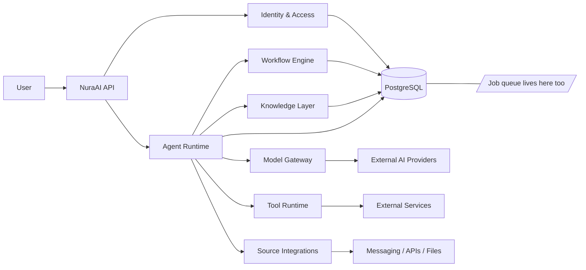

# NuraAI

NuraAI is a multi-tenant AI orchestration platform for teams that need secure, governed, and extensible agent-based workflows.

It brings together:

- users and team membership
- AI agents and model orchestration
- permissions and access control
- knowledge retrieval
- external source integrations
- tools and automation workflows

## Mission

NuraAI aims to make AI usable in real organizational workflows without sacrificing governance, safety, or traceability.

**For any past run, answer exactly what instructions caused it.**

An agent that acts on your behalf is only as trustworthy as your ability to reconstruct why it acted. A run's own account of itself does not count — a successful injection can make an agent misreport what it did — so the record is written by the runtime from the actual execution path, not from the model's narration.

Four things make that answerable rather than aspirational: every run pins the resolved configuration that produced it, workflow versions are immutable so an edit cannot change a run already in flight, every tool call is recorded before it executes and includes the ones that were denied, and the audit log is a transactional write that is never sampled.

## Core Concepts

- User: the canonical identity of a human person.
- Team: the collaboration boundary for a group of users and resources.
- Agent: the operational AI worker that executes tasks.
- Model: the underlying capability abstraction for the chosen AI provider.
- Source: the external channel or integration through which data enters or leaves the system.
- Tool: an executable capability available to agents and workflows.
- Permission: the explicit authorization model for actions and resources.
- Knowledge: the context available to agents during execution.
- Workflow: automation logic that orchestrates triggers, steps, and outputs.

## Architecture at a Glance



## Documentation Index

- [docs/01-user.md](docs/01-user.md) — User identity and ownership model
- [docs/02-team.md](docs/02-team.md) — Team collaboration boundary
- [docs/03-agent.md](docs/03-agent.md) — Agent runtime and responsibilities
- [docs/04-model.md](docs/04-model.md) — Model abstraction and capability metadata
- [docs/05-source.md](docs/05-source.md) — External data and channel integrations
- [docs/06-tool.md](docs/06-tool.md) — Safe tool execution model
- [docs/07-permission.md](docs/07-permission.md) — Role and access control model
- [docs/08-knowledge.md](docs/08-knowledge.md) — Knowledge retrieval and context management
- [docs/09-workflow.md](docs/09-workflow.md) — Automated execution flows
- [docs/10-architecture.md](docs/10-architecture.md) — High-level system architecture
- [docs/11-runtime.md](docs/11-runtime.md) — Execution lifecycle and runtime flows
- [docs/12-security.md](docs/12-security.md) — Security model and governance
- [docs/13-roadmap.md](docs/13-roadmap.md) — Delivery and engineering roadmap
- [docs/14-database.md](docs/14-database.md) — Relational schema reference and rationale
- [docs/15-api.md](docs/15-api.md) — REST API surface and contracts
- [docs/16-backend-architecture.md](docs/16-backend-architecture.md) — Backend structure and service breakdown
- [docs/17-threat-model.md](docs/17-threat-model.md) — Prompt injection, confused deputy, and the trust model
- [docs/18-production-checklist.md](docs/18-production-checklist.md) — Production readiness gates and risk areas
- [docs/19-tech-stack.md](docs/19-tech-stack.md) — Stack decisions, environment contract, and nginx boundary
- [docs/20-authentication.md](docs/20-authentication.md) — Wallet sign-in and token design
- [docs/21-testing.md](docs/21-testing.md) — Testing strategy, security suites, and evals
- [docs/22-observability.md](docs/22-observability.md) — Logs, metrics, traces, alerts, and SLOs
- [docs/23-job-queue.md](docs/23-job-queue.md) — Database-backed queue, leases, and scheduling
- [docs/24-ui-standards.md](docs/24-ui-standards.md) — Design system, the quarantine primitive, RTL, and accessibility
- [docs/25-ui-information.md](docs/25-ui-information.md) — Screens, what each must show, and the security-critical views
- [docs/26-runbook.md](docs/26-runbook.md) — Incident triage procedures for observability and security pages

## Stack

| Layer    | Choice                                                              |
| -------- | ------------------------------------------------------------------- |
| Backend  | Fastify + TypeScript                                                |
| Frontend | React + Vite + TailwindCSS                                          |
| Database | PostgreSQL — the only supported engine; PGlite in-process for tests |
| Schema   | Drizzle, defined in code — no hand-written SQL in this repository   |
| Auth     | JWT issued after EVM wallet sign-in (EIP-4361 / SIWE)               |
| i18n     | react-i18next — English and Persian, RTL                            |
| Queue    | A table in the same database — no broker, no Redis                  |

**TLS and CORS are handled by nginx and are not implemented here.** See [docs/19-tech-stack.md](docs/19-tech-stack.md) for the full boundary and the environment contract.

## Production commands

The supported deployment here keeps PostgreSQL, the API, and the background worker on the same host. The worker includes scheduling and lease reaping; it is a separate process from the API. Deployment artifacts (systemd units, nginx site, Prometheus rules, Grafana dashboards) are owned by DevOps outside this repository. This repo provides the runtime contract DevOps deploys against: the production entrypoints below, the environment contract, `/health/ready`, and `/metrics`. Repository scripts do not install software, register OS services, or deploy; every migration remains an explicit operator action.

With the locked dependencies already installed, run the release gate from the repository root:

```bash
npm run release:check
```

This checks formatting, lint, API source and dedicated test typechecks, web typecheck, both builds, and all application tests. It then copies the compiled API to a disposable directory and applies its packaged SQL migrations and journal to in-memory PGlite, checks every compiled schema table, and replays migrations to verify idempotence. No production environment, external database, or listening service is needed. It is not a substitute for PostgreSQL backup/restore or operational readiness checks.

The API build cleans only `apps/api/dist`, excludes test files and standalone test helpers, and copies SQL migrations plus metadata into `dist/db/migrations`. Migration paths resolve relative to the module, not the working directory, in both source and compiled execution. Keep `apps/api/production.mjs`, `apps/api/package.json`, `apps/api/dist`, and the locked production dependency tree together; `dist` alone is not a dependency bundle. Serve the static `apps/web/dist` separately through your configured ingress; Vite preview is not a production service.

After reviewing host configuration and backups, the operator can run these commands (migration changes the configured database; start commands are long-running):

```bash
npm run config:production
npm run db:migrate:production
npm run start:api
npm run start:worker
```

Every production entry, including API workspace `start` and worker aliases, forces `NODE_ENV=production` portably before importing application code. Inject configuration through your process manager using [apps/api/.env.example](apps/api/.env.example) as the contract. No secret file is loaded automatically. Each command optionally accepts one explicit file, for example `npm run config:production -- --env-file="/absolute/path/to/settings.env"` (also accepts `--env-file PATH`). Paths are relative to the invoking working directory; workspace commands run in `apps/api`. Injected variables take precedence over file values, and an explicitly missing file fails. The runner uses Node's `loadEnvFile`; `NODE_OPTIONS` inside that file does not configure Node. `config:production` validates without opening a database or binding a port and does not print values.

Production SIWE requires HTTPS and an exact URI host/domain match, including a nondefault port. Duration syntax follows the existing integer `s`/`m`/`h`/`d` parser; this change does not redefine session lifetime policy. `.env.example` now matches the existing documented `30d` refresh default rather than its divergent `180d`; explicit deployment overrides remain supported, and existing sessions are not rewritten.

`MODEL_BASE_URL` and `MODEL_API_KEY` must be provided together or both omitted/empty. Without them, the optional provider remains unconfigured and runs fail closed. There is no environment `MODEL_ID`: the selected database model record supplies the provider and model name, which must correspond to the configured OpenAI-compatible endpoint. Configuration-only validation cannot check that remote model catalog.

Currently unsupported settings: `APPROVAL_NOTIFY_CHANNEL` is accepted but no notification channel is wired; `QUEUE_MAX_ATTEMPTS` is accepted but not propagated from configuration (enqueue uses its own defaults/overrides). Locale is owned by the web app (`apps/web/src/i18n/`); there are no API locale settings. Worker metrics currently bind to the fixed `127.0.0.1:9100`; no worker-port setting or multi-worker same-host port allocation is implemented. Dashboard/alerting setup remains external work.

Builds and tests disable automatic env-file discovery. Inject `VITE_API_BASE_URL` and `SOURCEMAP` explicitly for the web build when needed; the default API base is same-origin, and frontend build values are public, never secrets. This does not configure ingress, TLS, or trusted proxy addresses.

Runtime compatibility is checked against installed dependencies, not guessed: Vite 8.3.0 requires Node `^20.19.0 || >=22.12.0`; Vitest 5.0.1 narrows the full gate to `^22.12.0 || ^24.0.0 || >=26.0.0`. Node 24.12.0 is the runtime used for this release validation; no unverified runtime pin is introduced.

## Deployment (DevOps-owned)

Deployment artifacts — systemd units, the nginx site, Prometheus alert rules, Grafana dashboards, host provisioning, TLS, backups, and monitoring — live with DevOps outside this repository and are not checked in here.

What this repo guarantees to DevOps:

- Production entrypoints (`npm run start:api`, `npm run start:worker`, `npm run db:migrate:production`, `npm run config:production`) that force `NODE_ENV=production` and accept injected configuration per [apps/api/.env.example](apps/api/.env.example); no secret file loads automatically.
- `/health/ready` fails a rolling deploy before it takes traffic (config, database reachability, applied migrations); `/health/live` is process-only; `/metrics` exposes the Prometheus exposition on the API and the worker's scrape port.
- Same-origin API namespaces `/auth`, `/teams`, and `/users` with no `/api` prefix; `/health` and `/metrics` stay private behind the ingress.

Plan downtime; this is not a zero-downtime deployment recipe. The exact stop, migrate, and start sequence lives with DevOps alongside the units.

Run migrations only through the reviewed DevOps procedure; nothing in API/worker start migrates automatically.

## Recommended Delivery Strategy

The project should be built in phases:

1. Foundation and data model
2. Identity, teams, and permissions
3. Source and tool framework — including risk tiers and destination allowlists
4. Agent runtime and model gateway — including the trust-gated policy decision point
5. Knowledge and retrieval
6. Workflow orchestration
7. Operational visibility

Safety is not a phase. It lands in 3, 4, and 6 alongside the features it constrains — see [docs/13-roadmap.md](docs/13-roadmap.md).

## Design Principles

- default deny access
- least privilege for all actors
- explicit permission for tools and sources
- clear separation between human and agent identity
- auditable execution and observability
- provider abstraction for model integration
- workflow-driven automation with safe boundaries

### The one that shapes everything else

An agent is not a principal with intent. **It is a transport for whatever instructions reach its context.**

Any system that combines access to private data, exposure to untrusted content, and the ability to communicate externally can be made to move data from the first to the third using the second. NuraAI deliberately has all three, so this is a property of the product rather than a bug in an implementation.

Authorization therefore considers the **provenance of the instruction**, not only the identity of the executing agent. Two rules carry that:

- **Capability depends on context trust.** What a run may do is a function of the agent's grants _and_ the trust level of everything in its context. An agent exposed to external messages cannot take a write action unattended.
- **Destinations come from configuration, never from model output.** The model selects among pre-registered destinations by identifier. It never emits an address the runtime then uses.

The goal is containment, not prevention: the design assumes injection will succeed at the model layer. [docs/17-threat-model.md](docs/17-threat-model.md) is the document to read before writing any runtime code.

## Project Status

The repository contains an implemented and tested API core for phases 1–6, including migrations, wallet authentication, tenant and trust enforcement, tool execution, knowledge retrieval, workflows, and the database-backed queue. Phase 7 observability is also wired for structured logs, metrics, queue-boundary tracing, security signals, cost rollups, and incident triage; deployment automation, dashboards, and an alerting backend remain outstanding.

The stack is closed ([docs/19-tech-stack.md](docs/19-tech-stack.md)), the schema is specified ([docs/14-database.md](docs/14-database.md)), and the security model that constrains the runtime is written down ([docs/17-threat-model.md](docs/17-threat-model.md)).

[docs/18-production-checklist.md](docs/18-production-checklist.md) is the honest assessment of the remaining production work.

## Next Step

Build the MVP, in the order set out in [docs/13-roadmap.md](docs/13-roadmap.md).

The next milestone is **not** "production launch." It is a working MVP with security enforcement, automated tests, an observable runtime, and a deployment pipeline. The trust-gated capability matrix and injection containment suite are already implemented and tested; the remaining path is production hardening, deployment automation, and operational presentation (dashboards and alerting).
