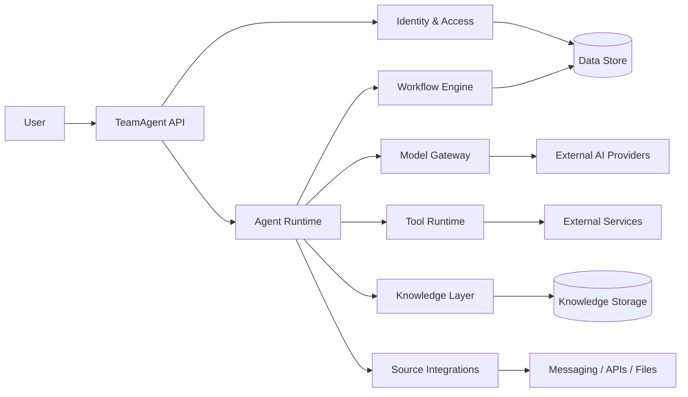

# TeamAgent

TeamAgent is a multi-tenant AI orchestration platform for teams that need secure, governed, and extensible agent-based workflows.

It brings together:
- users and team membership
- AI agents and model orchestration
- permissions and access control
- knowledge retrieval
- external source integrations
- tools and automation workflows

## Mission

TeamAgent aims to make AI usable in real organizational workflows without sacrificing governance, safety, or traceability.

## Core Concepts

- User: the canonical identity of a human person.
- Team: the collaboration boundary for a group of users and resources.
- Agent: the operational AI worker that executes tasks.
- Model: the underlying capability abstraction for the chosen AI provider.
- Source: the external channel or integration through which data enters or leaves the system.
- Tool: an executable capability available to agents and workflows.
- Permission: the explicit authorization model for actions and resources.
- Knowledge: the context available to agents during execution.
- Workflow: automation logic that orchestrates triggers, steps, and outputs.

## Architecture at a Glance

## Documentation Index

- [docs/01-user.md](docs/01-user.md) — User identity and ownership model
- [docs/02-team.md](docs/02-team.md) — Team collaboration boundary
- [docs/03-agent.md](docs/03-agent.md) — Agent runtime and responsibilities
- [docs/04-model.md](docs/04-model.md) — Model abstraction and capability metadata
- [docs/05-source.md](docs/05-source.md) — External data and channel integrations
- [docs/06-tool.md](docs/06-tool.md) — Safe tool execution model
- [docs/07-permission.md](docs/07-permission.md) — Role and access control model
- [docs/08-knowledge.md](docs/08-knowledge.md) — Knowledge retrieval and context management
- [docs/09-workflow.md](docs/09-workflow.md) — Automated execution flows
- [docs/10-architecture.md](docs/10-architecture.md) — High-level system architecture
- [docs/11-runtime.md](docs/11-runtime.md) — Execution lifecycle and runtime flows
- [docs/12-security.md](docs/12-security.md) — Security model and governance
- [docs/13-roadmap.md](docs/13-roadmap.md) — Delivery and engineering roadmap

## Recommended Delivery Strategy

The project should be built in phases:

1. Foundation and data model
2. Identity, teams, and permissions
3. Source and tool framework
4. Agent runtime and model gateway
5. Knowledge and retrieval
6. Workflow orchestration
7. Observability and safety controls

## Design Principles

- default deny access
- least privilege for all actors
- explicit permission for tools and sources
- clear separation between human and agent identity
- auditable execution and observability
- provider abstraction for model integration
- workflow-driven automation with safe boundaries

## Project Status

This repository currently contains the product design and architecture documentation required to define the system clearly and move into implementation planning.

## Next Step

The next logical milestone is to convert this design into a concrete technical stack and implementation plan, including database schema, API contracts, and the first working MVP.
