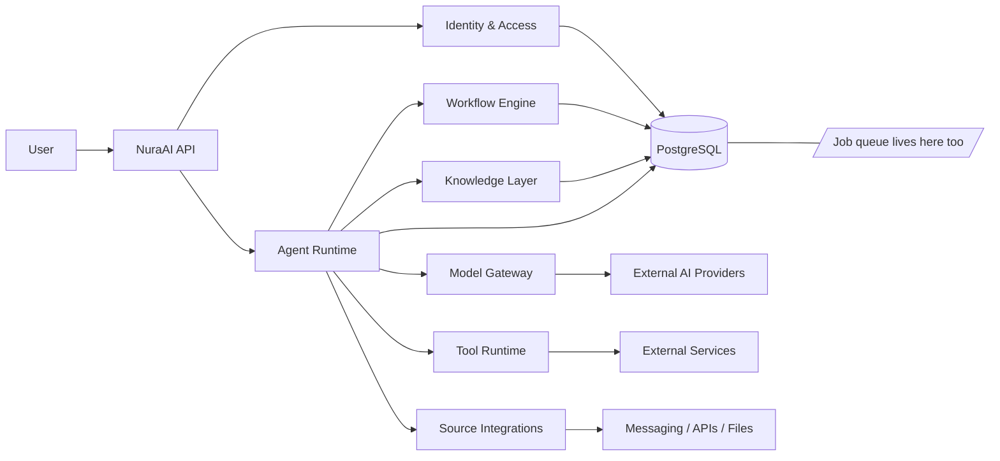

# NuraAI

NuraAI is a multi-tenant AI orchestration platform for teams that need secure, governed, and extensible agent-based workflows.

It brings together:
- users and team membership
- AI agents and model orchestration
- permissions and access control
- knowledge retrieval
- external source integrations
- tools and automation workflows

## Mission

NuraAI aims to make AI usable in real organizational workflows without sacrificing governance, safety, or traceability.

**For any past run, answer exactly what instructions caused it.**

An agent that acts on your behalf is only as trustworthy as your ability to reconstruct why it acted. A run's own account of itself does not count — a successful injection can make an agent misreport what it did — so the record is written by the runtime from the actual execution path, not from the model's narration.

Four things make that answerable rather than aspirational: every run pins the resolved configuration that produced it, workflow versions are immutable so an edit cannot change a run already in flight, every tool call is recorded before it executes and includes the ones that were denied, and the audit log is a transactional write that is never sampled.

## Core Concepts

- User: the canonical identity of a human person.
- Team: the collaboration boundary for a group of users and resources.
- Agent: the operational AI worker that executes tasks.
- Model: the underlying capability abstraction for the chosen AI provider.
- Source: the external channel or integration through which data enters or leaves the system.
- Tool: an executable capability available to agents and workflows.
- Permission: the explicit authorization model for actions and resources.
- Knowledge: the context available to agents during execution.
- Workflow: automation logic that orchestrates triggers, steps, and outputs.

## Architecture at a Glance

## Documentation Index

- [docs/01-user.md](docs/01-user.md) — User identity and ownership model
- [docs/02-team.md](docs/02-team.md) — Team collaboration boundary
- [docs/03-agent.md](docs/03-agent.md) — Agent runtime and responsibilities
- [docs/04-model.md](docs/04-model.md) — Model abstraction and capability metadata
- [docs/05-source.md](docs/05-source.md) — External data and channel integrations
- [docs/06-tool.md](docs/06-tool.md) — Safe tool execution model
- [docs/07-permission.md](docs/07-permission.md) — Role and access control model
- [docs/08-knowledge.md](docs/08-knowledge.md) — Knowledge retrieval and context management
- [docs/09-workflow.md](docs/09-workflow.md) — Automated execution flows
- [docs/10-architecture.md](docs/10-architecture.md) — High-level system architecture
- [docs/11-runtime.md](docs/11-runtime.md) — Execution lifecycle and runtime flows
- [docs/12-security.md](docs/12-security.md) — Security model and governance
- [docs/13-roadmap.md](docs/13-roadmap.md) — Delivery and engineering roadmap
- [docs/14-database.md](docs/14-database.md) — Relational schema reference and rationale
- [docs/15-api.md](docs/15-api.md) — REST API surface and contracts
- [docs/16-backend-architecture.md](docs/16-backend-architecture.md) — Backend structure and service breakdown
- [docs/17-threat-model.md](docs/17-threat-model.md) — Prompt injection, confused deputy, and the trust model
- [docs/18-production-checklist.md](docs/18-production-checklist.md) — Production readiness gates and risk areas
- [docs/19-tech-stack.md](docs/19-tech-stack.md) — Stack decisions, environment contract, and nginx boundary
- [docs/20-authentication.md](docs/20-authentication.md) — Wallet sign-in and token design
- [docs/21-testing.md](docs/21-testing.md) — Testing strategy, security suites, and evals
- [docs/22-observability.md](docs/22-observability.md) — Logs, metrics, traces, alerts, and SLOs
- [docs/23-job-queue.md](docs/23-job-queue.md) — Database-backed queue, leases, and scheduling
- [docs/24-ui-standards.md](docs/24-ui-standards.md) — Design system, the quarantine primitive, RTL, and accessibility
- [docs/25-ui-information.md](docs/25-ui-information.md) — Screens, what each must show, and the security-critical views

## Stack

| Layer | Choice |
|---|---|
| Backend | Fastify + TypeScript |
| Frontend | React + Vite + TailwindCSS |
| Database | PostgreSQL — the only supported engine; PGlite in-process for tests |
| Schema | Drizzle, defined in code — no hand-written SQL in this repository |
| Auth | JWT issued after EVM wallet sign-in (EIP-4361 / SIWE) |
| i18n | react-i18next — English and Persian, RTL |
| Queue | A table in the same database — no broker, no Redis |

**TLS and CORS are handled by nginx and are not implemented here.** See [docs/19-tech-stack.md](docs/19-tech-stack.md) for the full boundary and the environment contract.

## Recommended Delivery Strategy

The project should be built in phases:

1. Foundation and data model
2. Identity, teams, and permissions
3. Source and tool framework — including risk tiers and destination allowlists
4. Agent runtime and model gateway — including the trust-gated policy decision point
5. Knowledge and retrieval
6. Workflow orchestration
7. Operational visibility

Safety is not a phase. It lands in 3, 4, and 6 alongside the features it constrains — see [docs/13-roadmap.md](docs/13-roadmap.md).

## Design Principles

- default deny access
- least privilege for all actors
- explicit permission for tools and sources
- clear separation between human and agent identity
- auditable execution and observability
- provider abstraction for model integration
- workflow-driven automation with safe boundaries

### The one that shapes everything else

An agent is not a principal with intent. **It is a transport for whatever instructions reach its context.**

Any system that combines access to private data, exposure to untrusted content, and the ability to communicate externally can be made to move data from the first to the third using the second. NuraAI deliberately has all three, so this is a property of the product rather than a bug in an implementation.

Authorization therefore considers the **provenance of the instruction**, not only the identity of the executing agent. Two rules carry that:

- **Capability depends on context trust.** What a run may do is a function of the agent's grants *and* the trust level of everything in its context. An agent exposed to external messages cannot take a write action unattended.
- **Destinations come from configuration, never from model output.** The model selects among pre-registered destinations by identifier. It never emits an address the runtime then uses.

The goal is containment, not prevention: the design assumes injection will succeed at the model layer. [docs/17-threat-model.md](docs/17-threat-model.md) is the document to read before writing any runtime code.

## Project Status

Design complete, implementation not started. The repository holds the product design, the architecture, the schema reference, the API contracts, the threat model, and the operational design — everything needed to start building, and no code yet.

The stack is closed ([docs/19-tech-stack.md](docs/19-tech-stack.md)), the schema is specified ([docs/14-database.md](docs/14-database.md)), and the security model that constrains the runtime is written down ([docs/17-threat-model.md](docs/17-threat-model.md)).

[docs/18-production-checklist.md](docs/18-production-checklist.md) is the honest assessment of what is missing.

## Next Step

Build the MVP, in the order set out in [docs/13-roadmap.md](docs/13-roadmap.md).

The next milestone is **not** "production launch." It is a working MVP with security enforcement, automated tests, an observable runtime, and a deployment pipeline. One sequencing note worth repeating from the roadmap: the trust-gated capability matrix is a pure function with no I/O, and it should be written and fully tested *before* there is an agent runtime to attach it to.
