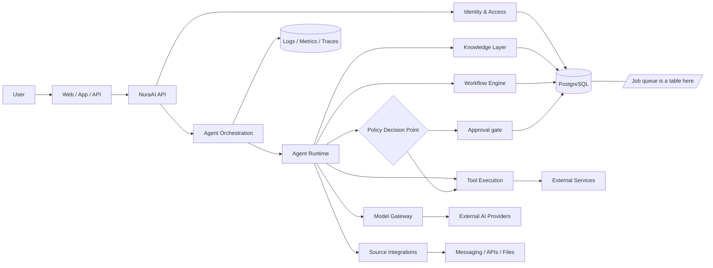

# Architecture

`NuraAI` is designed as a multi-tenant, workflow-driven AI orchestration platform. It separates identity, agent execution, model access, source integrations, permissions, knowledge, and automation logic so that each component can evolve independently.

## Goals
- Support multiple teams and users in one deployment.
- Keep human and agent permissions distinct.
- Allow model providers to be swapped without changing agent logic.
- Secure access to sources, tools, and knowledge.
- Run both interactive and automated flows.
- Record actions for audit, safety, and debugging.
- Contain a successful prompt injection, on the assumption that one will occur.

## High-Level Architecture



## Core Layers

### 1. Experience Layer
This layer includes user interfaces and API surfaces through which humans and systems interact with NuraAI.

Responsibilities:
- Authenticate and authorize users.
- Create teams, agents, workflows, and sources.
- Trigger model and workflow execution.
- Display status, logs, and results.

### 2. Core Application Layer
This layer contains the main domain logic for teams, identities, permissions, agents, knowledge, sources, workflows, and models.

Responsibilities:
- Validate domain rules.
- Enforce access control.
- Route tasks to correct runtime components.
- Maintain state transitions.

### 3. Runtime Layer
This layer executes agent tasks and workflows in controlled environments.

Responsibilities:
- Invoke model calls.
- Evaluate tool usage.
- Retrieve relevant knowledge.
- Track execution state and errors.
- Apply retries, timeouts, and safety checks.

### 4. Integration Layer
This layer connects NuraAI to external systems and providers.

Examples:
- Messaging: Telegram, WhatsApp, Discord, Email
- Files: Storage, attachments, documents
- Knowledge: GitHub, Notion, websites, databases
- Tools: search, browser, code execution, APIs
- Model providers: OpenAI, Anthropic, Gemini, local models

### 5. Data and Observability Layer
This layer stores persistent business data and execution telemetry.

Responsibilities:
- Keep team, user, agent, and workflow records.
- Store messages, logs, and execution history.
- Support analytics and auditing.
- Preserve versioning and traceability.

## Domain Boundaries

### NuraAI Core
Owns the canonical business model and trust boundaries.

Includes:
- User and team management
- Agent configuration
- Permissions and policies
- Source registration
- Workflow definitions
- Knowledge access

### Agent Runtime
Owns execution decisions for a specific task.

Includes:
- Prompt assembly
- Tool selection
- Knowledge retrieval
- Tool invocation
- Response generation
- Execution result packaging

### Model Gateway
Owns provider integration and capability adaptation.

Responsibilities:
- Normalize model metadata.
- Route by provider and capability.
- Apply limits, quotas, and pricing metadata.
- Surface errors consistently.

### Workflow Engine
Owns automation control flow.

Responsibilities:
- Trigger execution from event or schedule.
- Manage steps, retries, and branching.
- Route data among agents and tools.
- Emit audit records and outputs.

## Execution Model

NuraAI does not assume a single linear request path. Execution may be:
- Human-initiated through an app or API
- Agent-initiated through a workflow trigger
- Tool-triggered during a running task
- Scheduled or event-driven automation

A common execution model is:

```text
User / Event
  -> API
  -> Identity + permission resolution
  -> Agent Runtime
  -> Knowledge retrieval, computing effective context trust
  -> loop:  Model  ->  policy decision  ->  Tool  ->  result as untrusted  ->  Model
  -> Destination resolved from the allowlist
  -> Output
```

The loop is the shape that matters. **The model chooses the tool**, so no tool call precedes the first inference, and every tool result re-enters the context as `untrusted`, lowering the effective trust for every subsequent iteration. An earlier revision of this line showed `Knowledge -> Tool -> Model`, which inverted the control flow and hid both properties.

## Key Design Principles
- Default deny for permissions.
- Explicit source and tool access grants.
- Separation of human identity and agent identity, with no agent ever holding an `admin`-tier permission.
- **Capability is a function of the grant and the provenance of the instruction**, evaluated at execution time in the tool runtime. This is the principle that shapes the runtime layer; everything else is conventional.
- **Destinations come from configuration, never from model output.**
- Use provider abstraction rather than direct model coupling.
- Make execution observable and auditable, from the actual execution path rather than from what the model reports doing.
- Prefer structured tools and APIs over free-form access.

## Architectural Risks to Watch

The first one is structural rather than a mistake to avoid:

- **Prompt injection and the confused deputy.** Every agent here has access to private data, exposure to untrusted content, and the ability to communicate externally. Any system with all three can be made to move data from the first to the third using the second. This is a direct consequence of the feature set, not a bug in an implementation, and the architecture is arranged to contain it rather than to prevent it. `docs/17-threat-model.md` is the design document for this and should be read before the runtime layer is built.

The conventional ones:

- Over-permissioned agents
- Unbounded tool access
- Hidden provider coupling
- Missing execution logs
- Unclear ownership of knowledge and sources
- Weak tenant isolation
- Trust labels dropped at a boundary — between workflow steps, across the queue, or at an API-key ingress

## Recommended Initial Deployment Shape
A first production-ready version should separate:
- API service
- Worker runtime for agent execution
- Workflow engine
- A single database, which also holds the job queue (`docs/23-job-queue.md`)
- Object storage for files and knowledge
- Monitoring/alerting stack

These are separate *processes*, not separate datastores. There is no broker, cache, or event store beside the database.

This decomposition makes safe scaling easier and reduces coupling between human interaction and long-running automation.
