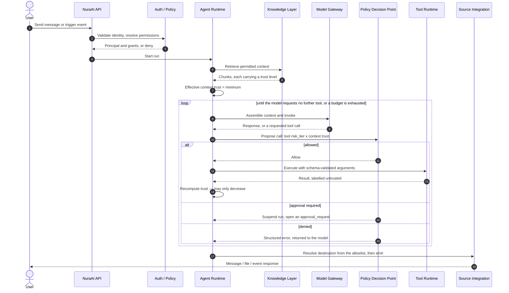
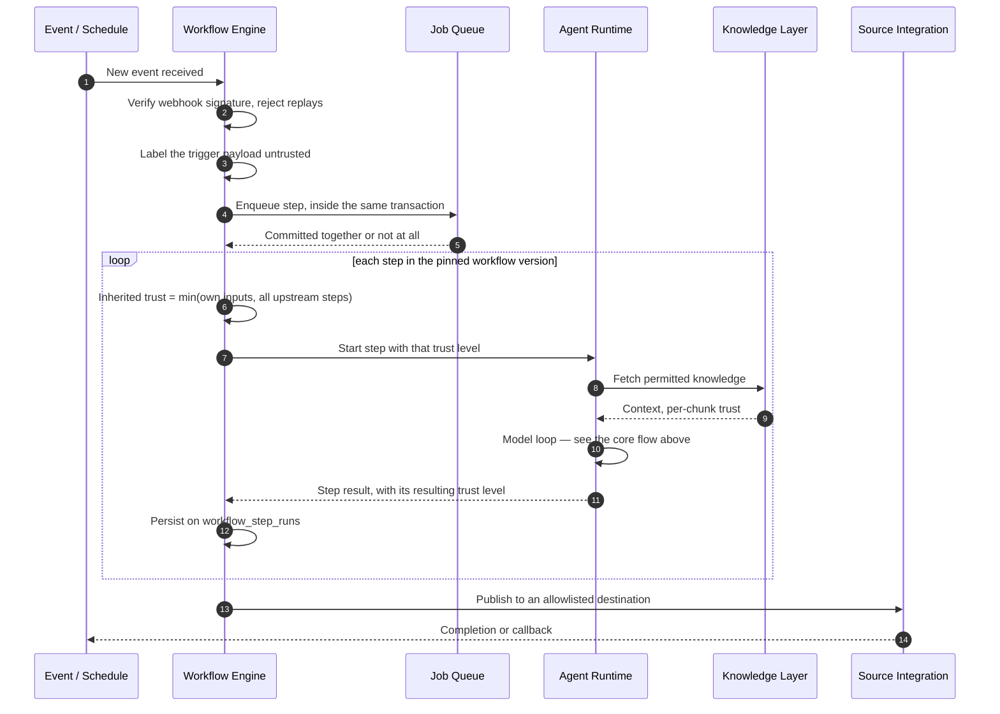

# Runtime Flows and Execution Model

This document explains how NuraAI behaves at runtime, including the sequence of events from a user action to the final output.

## Core Runtime Flow

**The loop is the point.** The model chooses the tool; the runtime does not call one on its behalf beforehand. An earlier revision of this diagram showed a single tool call *before* the model invocation, which inverted the control flow and hid the two properties that matter most: that every tool result re-enters the context as `untrusted` and lowers the effective trust of everything after it, and that the policy decision is re-evaluated on each iteration rather than once per run.

## Typical Agent Execution

1. A user, API key, or system event triggers an action.
2. The API validates the caller and resolves permissions for this request — never from a token claim (`docs/20-authentication.md`).
3. The agent resolves its runtime configuration, and that resolved configuration is pinned to `agent_runs.agent_snapshot`.
4. Relevant knowledge is retrieved, filtered by access scope.
5. The runtime computes the **effective context trust** as the minimum over every item in the context, including the trust ceiling of the ingress path, and persists it on the run.
6. The model is invoked. It may return a final response or request a tool call.
7. If a tool is requested, the policy decision point evaluates the tool's `risk_tier` against the context trust and returns allow, deny, or approval-required. The result is written to `tool_calls` **before** execution.
8. A tool result re-enters the context labelled `untrusted`, trust is recomputed downward, and step 6 repeats.
9. Budgets are checked on every iteration — tokens, tool count, depth, wall clock.
10. Output destinations are resolved from `allowed_destinations` after generation, never from the model's text.
11. The output is sent back to the source or user.
12. Execution details are logged and stored for audit, written by the runtime from the actual execution path rather than from the model's account of it.

## Workflow Runtime Flow

Two things this diagram is making explicit. **The run executes a pinned `workflow_version`**, so editing the workflow mid-flight cannot change what a running execution means. And **trust is inherited, not reset** — a step's trust is the minimum of its own inputs and every upstream step that fed it, which is what stops a low-privilege step laundering attacker instructions into a high-privilege one (`docs/17-threat-model.md` T8).

An unattended workflow has no human in the loop, so `docs/17` C5's approval fallback is unavailable to it. Unattended steps are therefore restricted to the `read_only` and `reply` tiers unless a pre-approved, narrowly scoped rule exists.

## State Model

### Agent run
States may include:
- `queued`
- `running`
- `waiting_for_tool`
- `waiting_for_approval`
- `succeeded`
- `failed`
- `denied`
- `budget_exceeded`
- `cancelled`

`waiting_for_approval` and `budget_exceeded` are not cosmetic. A run suspended on an approval gate (`docs/17-threat-model.md` C5) has to be distinguishable from one that is merely slow, because the approval expires and an expired approval is a denial. A run terminated by a budget (C10) has to be distinguishable from a crash, because it is a cost and security signal rather than a fault.

### Workflow
States may include:
- `draft`
- `active`
- `paused`
- `running`
- `succeeded`
- `failed`
- `archived`

### Source Connection
States may include:
- `disconnected`
- `connecting`
- `connected`
- `error`
- `suspended`

## Tool Execution Lifecycle

1. The **model** requests the tool. The runtime does not choose one on its behalf.
2. The policy decision point confirms the agent holds the permission **and** that the effective tier — the higher of the `tool.execute` grant and the tool's own `risk_tier` — is permitted at the current context trust level. This check lives in the tool runtime, immediately before execution; a check at agent configuration time is advisory only.
3. A `tool_calls` row is written with the decision and its reason, before anything executes, so a crash mid-call still leaves evidence.
4. Input is validated against `input_schema` with the narrowest available types — enums over free strings, allowlisted identifiers, named parameterized queries rather than SQL text.
5. Any destination is resolved from `allowed_destinations`. A proposed destination outside the list is denied and recorded, never fuzzy-matched.
6. Credentials are injected inside the tool sandbox, after arguments are fixed, so no secret value is ever in the model's context.
7. The tool executes under a timeout and the run's remaining budget.
8. Output is normalized, **labelled `untrusted`**, and returned to the model.
9. The `tool_calls` row is updated with the outcome.

A denial is returned to the model as a structured error rather than silently dropped, so the agent can explain the refusal instead of looping against it.

## Knowledge Retrieval Lifecycle

1. Task is received.
2. Intent and context are extracted.
3. Knowledge indexes are searched, scoped to the bases this agent is explicitly permitted to read.
4. Results are ranked by relevance and access scope.
5. Only approved content is included.
6. Retrieved knowledge is added to the model context, **each chunk carrying its own `trust_level` and origin**, wrapped in a delimited block that states it is data rather than instruction.
7. The effective context trust drops to the minimum across the result set. One `untrusted` chunk taints the run, which is intended.

## Failure and Retry Model

A robust runtime should include:
- timeouts per tool and model call
- exponential backoff for transient errors
- circuit breaking for failing integrations
- step-level retry policies
- execution cancellation when policies deny access
- human-visible error summaries for users

## Operational Notes
- Every tool or model call should be auditable.
- Long-running tasks should produce intermediate status updates.
- Sensitive actions should require explicit policy approval.
- Results should be traceable to a specific user, team, agent, and workflow.

## Recommended Runtime Guarantees
- Idempotency for critical actions when possible.
- Structured logs for each execution step.
- Explicit error codes for tooling and integration failures.
- Resource limits per team and agent.
- Clear boundaries between interactive and automation execution.
