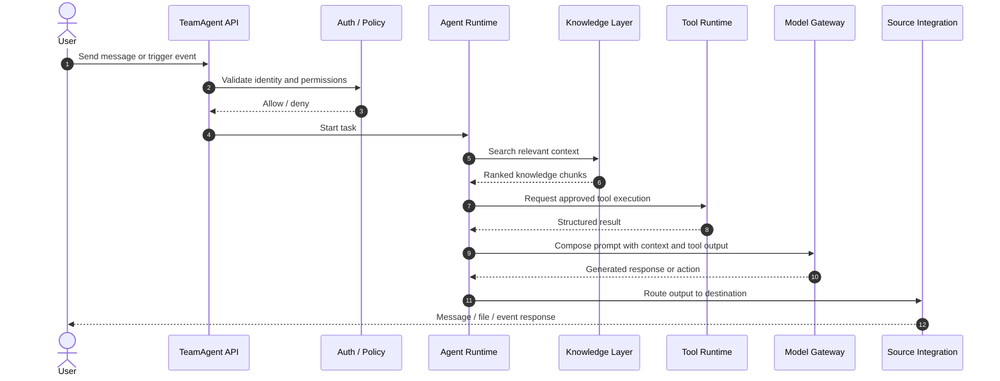
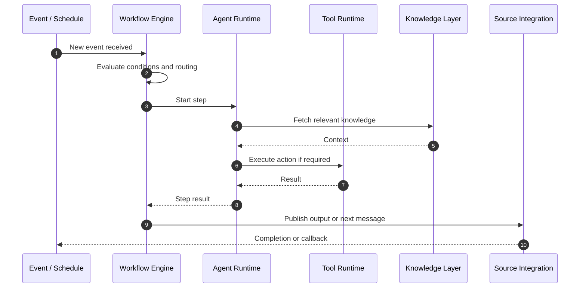

# Runtime Flows and Execution Model

This document explains how TeamAgent behaves at runtime, including the sequence of events from a user action to the final output.

## Core Runtime Flow

## Typical Agent Execution

1. A user or system triggers an action.
2. The API validates the caller and checks permission scope.
3. The agent resolves its runtime configuration.
4. Relevant knowledge is retrieved.
5. The agent requests an approved tool if needed.
6. The model generates a response using retrieved context and execution results.
7. The output is sent back to the source or user.
8. Execution details are logged and stored for audit.

## Workflow Runtime Flow

## State Model

### Agent
States may include:
- `idle`
- `starting`
- `running`
- `waiting_for_tool`
- `completed`
- `failed`
- `disabled`

### Workflow
States may include:
- `draft`
- `active`
- `paused`
- `running`
- `succeeded`
- `failed`
- `archived`

### Source Connection
States may include:
- `disconnected`
- `connecting`
- `connected`
- `error`
- `suspended`

## Tool Execution Lifecycle

1. Agent identifies the required tool.
2. Policy checks confirm permission and scope.
3. Input is validated against the tool schema.
4. Tool is executed with sanitized inputs.
5. Output is normalized and returned.
6. Result is logged and attached to the execution record.

## Knowledge Retrieval Lifecycle

1. Task is received.
2. Intent and context are extracted.
3. Knowledge indexes are searched.
4. Results are ranked by relevance and access scope.
5. Only approved content is included.
6. Retrieved knowledge is added to the model context.

## Failure and Retry Model

A robust runtime should include:
- timeouts per tool and model call
- exponential backoff for transient errors
- circuit breaking for failing integrations
- step-level retry policies
- execution cancellation when policies deny access
- human-visible error summaries for users

## Operational Notes
- Every tool or model call should be auditable.
- Long-running tasks should produce intermediate status updates.
- Sensitive actions should require explicit policy approval.
- Results should be traceable to a specific user, team, agent, and workflow.

## Recommended Runtime Guarantees
- Idempotency for critical actions when possible.
- Structured logs for each execution step.
- Explicit error codes for tooling and integration failures.
- Resource limits per team and agent.
- Clear boundaries between interactive and automation execution.
