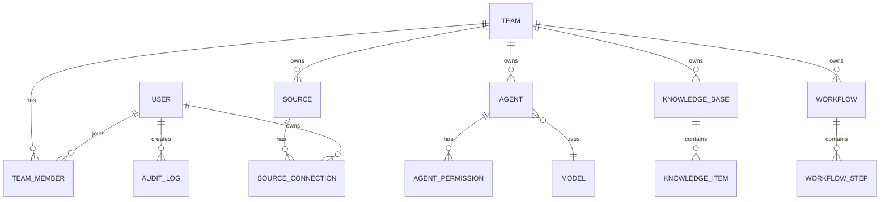

# Database Schema and Design

This document defines the initial database design for TeamAgent. It focuses on a relational schema that can support identity, team structure, agent configuration, source access, knowledge, workflow execution, and auditing.

## Design Goals

- support multi-tenancy by team
- separate principals from resources
- keep permissions explicit and auditable
- support multiple source integrations per user or team
- allow agents to have model, tool, and knowledge scopes
- record execution history and security events

## Core Design Principles

- every tenant-scoped resource belongs to a team
- users are canonical identities and may belong to multiple teams
- permissions are evaluated against roles and direct grants
- source and tool access is explicit and scoped
- workflows and agent execution are persisted for audit and retry

## Recommended Database Type

PostgreSQL is a strong default choice because it supports:
- foreign keys and strong integrity
- JSONB for flexible metadata
- arrays for some simple metadata if needed
- transactional reliability
- JSON schema or structured storage for configs

## Domain Model Summary



## Core Tables

### 1. users
Stores the canonical human identity.

| Column | Type | Notes |
|---|---|---|
| id | UUID | Primary key |
| name | VARCHAR(255) | Display name |
| email | VARCHAR(255) | Unique, nullable |
| avatar_url | TEXT | Nullable |
| locale | VARCHAR(20) | Nullable |
| timezone | VARCHAR(64) | Nullable |
| status | VARCHAR(32) | active, suspended, deleted |
| preferences | JSONB | User settings |
| created_at | TIMESTAMPTZ | Required |
| updated_at | TIMESTAMPTZ | Required |

### 2. teams
Stores the tenant and collaboration boundary.

| Column | Type | Notes |
|---|---|---|
| id | UUID | Primary key |
| name | VARCHAR(255) | Required |
| slug | VARCHAR(120) | Unique |
| owner_id | UUID | FK to users |
| status | VARCHAR(32) | active, suspended, archived |
| settings | JSONB | Team config |
| limits | JSONB | Usage and quota policy |
| created_at | TIMESTAMPTZ | Required |
| updated_at | TIMESTAMPTZ | Required |

### 3. team_members
Maps users to teams and role assignments.

| Column | Type | Notes |
|---|---|---|
| id | UUID | Primary key |
| team_id | UUID | FK to teams |
| user_id | UUID | FK to users |
| role | VARCHAR(64) | owner, admin, manager, member, viewer |
| status | VARCHAR(32) | active, invited, removed |
| created_at | TIMESTAMPTZ | Required |
| updated_at | TIMESTAMPTZ | Required |

### 4. roles and permissions
Use either a compact permission table or a role-based design. For initial implementation, the practical pattern is:
- roles table with named roles
- permissions table with action/resource definitions
- role_permissions join table
- user_role assignments or team_members role mapping

#### roles
| Column | Type | Notes |
|---|---|---|
| id | UUID | Primary key |
| team_id | UUID | FK to teams |
| name | VARCHAR(64) | role name |
| description | TEXT | nullable |
| created_at | TIMESTAMPTZ | Required |

#### permissions
| Column | Type | Notes |
|---|---|---|
| id | UUID | Primary key |
| name | VARCHAR(128) | unique permission key |
| resource_type | VARCHAR(64) | team, agent, workflow, source |
| action | VARCHAR(64) | view, create, edit, delete, run |
| description | TEXT | nullable |

#### role_permissions
| Column | Type | Notes |
|---|---|---|
| role_id | UUID | FK to roles |
| permission_id | UUID | FK to permissions |
| scope | JSONB | optional scope definition |

### 5. models
Stores model metadata for capabilities and provider abstraction.

| Column | Type | Notes |
|---|---|---|
| id | UUID | Primary key |
| provider | VARCHAR(128) | provider name |
| name | VARCHAR(128) | model name |
| version | VARCHAR(64) | nullable |
| type | VARCHAR(64) | chat, reasoning, coding, image |
| capabilities | JSONB | supported capabilities |
| context_limit | INTEGER | optional |
| input_types | JSONB | supported input types |
| output_types | JSONB | supported output types |
| pricing | JSONB | optional pricing metadata |
| status | VARCHAR(32) | available, disabled, deprecated |
| created_at | TIMESTAMPTZ | Required |
| updated_at | TIMESTAMPTZ | Required |

### 6. agents
Represents runtime AI agents.

| Column | Type | Notes |
|---|---|---|
| id | UUID | Primary key |
| team_id | UUID | FK to teams |
| model_id | UUID | FK to models |
| name | VARCHAR(255) | Required |
| description | TEXT | nullable |
| system_prompt | TEXT | Required |
| settings | JSONB | runtime config |
| status | VARCHAR(32) | active, disabled, archived |
| created_by | UUID | FK to users |
| created_at | TIMESTAMPTZ | Required |
| updated_at | TIMESTAMPTZ | Required |

### 7. agent_permissions
Stores explicit permissions for an agent.

| Column | Type | Notes |
|---|---|---|
| id | UUID | Primary key |
| agent_id | UUID | FK to agents |
| permission_name | VARCHAR(128) | e.g. tool.execute |
| scope_type | VARCHAR(64) | team, source, workflow, custom |
| scope_id | UUID | nullable |
| granted_at | TIMESTAMPTZ | Required |

### 8. sources
Stores the platform or channel definition.

| Column | Type | Notes |
|---|---|---|
| id | UUID | Primary key |
| team_id | UUID | nullable if user-owned |
| owner_type | VARCHAR(32) | user or team |
| owner_id | UUID | owner reference |
| type | VARCHAR(64) | telegram, email, api, file |
| name | VARCHAR(255) | display name |
| status | VARCHAR(32) | connected, disconnected, error |
| config | JSONB | non-secret config |
| capabilities | JSONB | supported actions |
| created_at | TIMESTAMPTZ | Required |
| updated_at | TIMESTAMPTZ | Required |

### 9. source_connections
Specific instance of a source integration.

| Column | Type | Notes |
|---|---|---|
| id | UUID | Primary key |
| source_id | UUID | FK to sources |
| user_id | UUID | nullable owner if user-level |
| connection_name | VARCHAR(255) | display label |
| connection_config | JSONB | provider/config values |
| credential_ref | VARCHAR(255) | secret reference or vault key |
| status | VARCHAR(32) | connected, error, expired |
| created_at | TIMESTAMPTZ | Required |
| updated_at | TIMESTAMPTZ | Required |

### 10. tools
Execution tools available to agents and workflows.

| Column | Type | Notes |
|---|---|---|
| id | UUID | Primary key |
| team_id | UUID | nullable if system-level |
| name | VARCHAR(255) | required |
| description | TEXT | nullable |
| type | VARCHAR(64) | search, browser, db, api, action |
| input_schema | JSONB | required |
| output_schema | JSONB | required |
| permissions | JSONB | required permissions list |
| status | VARCHAR(32) | available, disabled |
| created_at | TIMESTAMPTZ | Required |
| updated_at | TIMESTAMPTZ | Required |

### 11. knowledge_bases
Knowledge containers.

| Column | Type | Notes |
|---|---|---|
| id | UUID | Primary key |
| team_id | UUID | FK to teams |
| name | VARCHAR(255) | required |
| description | TEXT | nullable |
| type | VARCHAR(64) | document, url, database |
| status | VARCHAR(32) | ready, processing, failed |
| created_by | UUID | FK to users |
| created_at | TIMESTAMPTZ | Required |
| updated_at | TIMESTAMPTZ | Required |

### 12. knowledge_items
Actual knowledge entries.

| Column | Type | Notes |
|---|---|---|
| id | UUID | Primary key |
| knowledge_base_id | UUID | FK to knowledge_bases |
| title | VARCHAR(255) | required |
| content | TEXT | nullable |
| source_url | TEXT | nullable |
| metadata | JSONB | tags, author, dates |
| status | VARCHAR(32) | ready, failed, archived |
| created_at | TIMESTAMPTZ | Required |
| updated_at | TIMESTAMPTZ | Required |

### 13. workflows
Automation definitions.

| Column | Type | Notes |
|---|---|---|
| id | UUID | Primary key |
| team_id | UUID | FK to teams |
| name | VARCHAR(255) | required |
| description | TEXT | nullable |
| trigger_type | VARCHAR(64) | webhook, event, schedule, manual |
| trigger_config | JSONB | trigger definition |
| status | VARCHAR(32) | draft, active, paused, archived |
| settings | JSONB | retries, timeout, execution options |
| created_by | UUID | FK to users |
| created_at | TIMESTAMPTZ | Required |
| updated_at | TIMESTAMPTZ | Required |

### 14. workflow_steps
Ordered execution steps for workflows.

| Column | Type | Notes |
|---|---|---|
| id | UUID | Primary key |
| workflow_id | UUID | FK to workflows |
| step_index | INTEGER | required |
| type | VARCHAR(64) | agent, tool, condition, api, send |
| config | JSONB | step definition |
| condition_expr | TEXT | nullable |
| created_at | TIMESTAMPTZ | Required |

### 15. workflow_runs
Execution records for workflow execution history.

| Column | Type | Notes |
|---|---|---|
| id | UUID | Primary key |
| workflow_id | UUID | FK to workflows |
| status | VARCHAR(32) | queued, running, succeeded, failed |
| started_at | TIMESTAMPTZ | Required |
| finished_at | TIMESTAMPTZ | nullable |
| inputs | JSONB | workflow input payload |
| outputs | JSONB | output payload |
| error_message | TEXT | nullable |
| trace_id | VARCHAR(128) | for observability |

### 16. agent_runs
Execution history for agents.

| Column | Type | Notes |
|---|---|---|
| id | UUID | Primary key |
| agent_id | UUID | FK to agents |
| user_id | UUID | nullable user requester |
| workflow_run_id | UUID | nullable if part of workflow |
| status | VARCHAR(32) | queued, running, completed, failed |
| input_payload | JSONB | input data |
| output_payload | JSONB | result data |
| token_usage | JSONB | optional usage metrics |
| started_at | TIMESTAMPTZ | Required |
| finished_at | TIMESTAMPTZ | nullable |
| error_message | TEXT | nullable |
| trace_id | VARCHAR(128) | required for observability |

### 17. audit_logs
Secure operational log for governance and investigation.

| Column | Type | Notes |
|---|---|---|
| id | UUID | Primary key |
| actor_type | VARCHAR(32) | user, agent, system |
| actor_id | UUID | actor reference |
| resource_type | VARCHAR(64) | team, agent, source, workflow |
| resource_id | UUID | target resource |
| action | VARCHAR(128) | action name |
| details | JSONB | payload and metadata |
| created_at | TIMESTAMPTZ | Required |

## Core Relationships

### 1. Users and Teams
Users belong to multiple teams via `team_members`.

### 2. Team and Resources
Teams own many resources including:
- agents
- sources
- knowledge bases
- workflows
- team-specific permissions and roles

### 3. Agents and Models
Agents are linked to one model, but the system may support multiple provider models later.

### 4. Agents and Tools
Tool access is explicit through `agent_permissions` or a dedicated `agent_tools` table if the design needs finer-grained details.

### 5. Sources and Connections
A source is a definition; a source connection is a concrete integration instance with secrets or credential references.

### 6. Workflows and Execution Logs
Workflow definitions are separate from execution history, which makes retries, debugging, and audits easier.

## Recommended Initial SQL Schema

Use this as starting DDL for PostgreSQL:

```sql
CREATE EXTENSION IF NOT EXISTS "pgcrypto";

CREATE TABLE users (
  id UUID PRIMARY KEY DEFAULT gen_random_uuid(),
  name VARCHAR(255) NOT NULL,
  email VARCHAR(255) UNIQUE,
  avatar_url TEXT,
  locale VARCHAR(20),
  timezone VARCHAR(64),
  status VARCHAR(32) NOT NULL DEFAULT 'active',
  preferences JSONB NOT NULL DEFAULT '{}',
  created_at TIMESTAMPTZ NOT NULL DEFAULT NOW(),
  updated_at TIMESTAMPTZ NOT NULL DEFAULT NOW()
);

CREATE TABLE teams (
  id UUID PRIMARY KEY DEFAULT gen_random_uuid(),
  name VARCHAR(255) NOT NULL,
  slug VARCHAR(120) NOT NULL UNIQUE,
  owner_id UUID NOT NULL REFERENCES users(id) ON DELETE CASCADE,
  status VARCHAR(32) NOT NULL DEFAULT 'active',
  settings JSONB NOT NULL DEFAULT '{}',
  limits JSONB NOT NULL DEFAULT '{}',
  created_at TIMESTAMPTZ NOT NULL DEFAULT NOW(),
  updated_at TIMESTAMPTZ NOT NULL DEFAULT NOW()
);

CREATE TABLE team_members (
  id UUID PRIMARY KEY DEFAULT gen_random_uuid(),
  team_id UUID NOT NULL REFERENCES teams(id) ON DELETE CASCADE,
  user_id UUID NOT NULL REFERENCES users(id) ON DELETE CASCADE,
  role VARCHAR(64) NOT NULL DEFAULT 'member',
  status VARCHAR(32) NOT NULL DEFAULT 'active',
  created_at TIMESTAMPTZ NOT NULL DEFAULT NOW(),
  updated_at TIMESTAMPTZ NOT NULL DEFAULT NOW(),
  UNIQUE(team_id, user_id)
);

CREATE TABLE models (
  id UUID PRIMARY KEY DEFAULT gen_random_uuid(),
  provider VARCHAR(128) NOT NULL,
  name VARCHAR(128) NOT NULL,
  version VARCHAR(64),
  type VARCHAR(64) NOT NULL,
  capabilities JSONB NOT NULL DEFAULT '{}',
  context_limit INTEGER,
  input_types JSONB NOT NULL DEFAULT '[]',
  output_types JSONB NOT NULL DEFAULT '[]',
  pricing JSONB DEFAULT '{}',
  status VARCHAR(32) NOT NULL DEFAULT 'available',
  created_at TIMESTAMPTZ NOT NULL DEFAULT NOW(),
  updated_at TIMESTAMPTZ NOT NULL DEFAULT NOW()
);

CREATE TABLE agents (
  id UUID PRIMARY KEY DEFAULT gen_random_uuid(),
  team_id UUID NOT NULL REFERENCES teams(id) ON DELETE CASCADE,
  model_id UUID NOT NULL REFERENCES models(id),
  name VARCHAR(255) NOT NULL,
  description TEXT,
  system_prompt TEXT NOT NULL,
  settings JSONB NOT NULL DEFAULT '{}',
  status VARCHAR(32) NOT NULL DEFAULT 'active',
  created_by UUID NOT NULL REFERENCES users(id),
  created_at TIMESTAMPTZ NOT NULL DEFAULT NOW(),
  updated_at TIMESTAMPTZ NOT NULL DEFAULT NOW()
);

CREATE TABLE sources (
  id UUID PRIMARY KEY DEFAULT gen_random_uuid(),
  team_id UUID REFERENCES teams(id) ON DELETE CASCADE,
  owner_type VARCHAR(32) NOT NULL,
  owner_id UUID NOT NULL,
  type VARCHAR(64) NOT NULL,
  name VARCHAR(255) NOT NULL,
  status VARCHAR(32) NOT NULL DEFAULT 'connected',
  config JSONB NOT NULL DEFAULT '{}',
  capabilities JSONB NOT NULL DEFAULT '{}',
  created_at TIMESTAMPTZ NOT NULL DEFAULT NOW(),
  updated_at TIMESTAMPTZ NOT NULL DEFAULT NOW()
);

CREATE TABLE source_connections (
  id UUID PRIMARY KEY DEFAULT gen_random_uuid(),
  source_id UUID NOT NULL REFERENCES sources(id) ON DELETE CASCADE,
  user_id UUID REFERENCES users(id) ON DELETE SET NULL,
  connection_name VARCHAR(255) NOT NULL,
  connection_config JSONB NOT NULL DEFAULT '{}',
  credential_ref VARCHAR(255),
  status VARCHAR(32) NOT NULL DEFAULT 'connected',
  created_at TIMESTAMPTZ NOT NULL DEFAULT NOW(),
  updated_at TIMESTAMPTZ NOT NULL DEFAULT NOW()
);

CREATE TABLE tools (
  id UUID PRIMARY KEY DEFAULT gen_random_uuid(),
  team_id UUID REFERENCES teams(id) ON DELETE CASCADE,
  name VARCHAR(255) NOT NULL,
  description TEXT,
  type VARCHAR(64) NOT NULL,
  input_schema JSONB NOT NULL,
  output_schema JSONB NOT NULL,
  permissions JSONB NOT NULL DEFAULT '[]',
  status VARCHAR(32) NOT NULL DEFAULT 'available',
  created_at TIMESTAMPTZ NOT NULL DEFAULT NOW(),
  updated_at TIMESTAMPTZ NOT NULL DEFAULT NOW()
);

CREATE TABLE knowledge_bases (
  id UUID PRIMARY KEY DEFAULT gen_random_uuid(),
  team_id UUID NOT NULL REFERENCES teams(id) ON DELETE CASCADE,
  name VARCHAR(255) NOT NULL,
  description TEXT,
  type VARCHAR(64) NOT NULL,
  status VARCHAR(32) NOT NULL DEFAULT 'ready',
  created_by UUID NOT NULL REFERENCES users(id),
  created_at TIMESTAMPTZ NOT NULL DEFAULT NOW(),
  updated_at TIMESTAMPTZ NOT NULL DEFAULT NOW()
);

CREATE TABLE knowledge_items (
  id UUID PRIMARY KEY DEFAULT gen_random_uuid(),
  knowledge_base_id UUID NOT NULL REFERENCES knowledge_bases(id) ON DELETE CASCADE,
  title VARCHAR(255) NOT NULL,
  content TEXT,
  source_url TEXT,
  metadata JSONB NOT NULL DEFAULT '{}',
  status VARCHAR(32) NOT NULL DEFAULT 'ready',
  created_at TIMESTAMPTZ NOT NULL DEFAULT NOW(),
  updated_at TIMESTAMPTZ NOT NULL DEFAULT NOW()
);

CREATE TABLE workflows (
  id UUID PRIMARY KEY DEFAULT gen_random_uuid(),
  team_id UUID NOT NULL REFERENCES teams(id) ON DELETE CASCADE,
  name VARCHAR(255) NOT NULL,
  description TEXT,
  trigger_type VARCHAR(64) NOT NULL,
  trigger_config JSONB NOT NULL DEFAULT '{}',
  status VARCHAR(32) NOT NULL DEFAULT 'draft',
  settings JSONB NOT NULL DEFAULT '{}',
  created_by UUID NOT NULL REFERENCES users(id),
  created_at TIMESTAMPTZ NOT NULL DEFAULT NOW(),
  updated_at TIMESTAMPTZ NOT NULL DEFAULT NOW()
);

CREATE TABLE workflow_steps (
  id UUID PRIMARY KEY DEFAULT gen_random_uuid(),
  workflow_id UUID NOT NULL REFERENCES workflows(id) ON DELETE CASCADE,
  step_index INTEGER NOT NULL,
  type VARCHAR(64) NOT NULL,
  config JSONB NOT NULL DEFAULT '{}',
  condition_expr TEXT,
  created_at TIMESTAMPTZ NOT NULL DEFAULT NOW(),
  UNIQUE(workflow_id, step_index)
);

CREATE TABLE workflow_runs (
  id UUID PRIMARY KEY DEFAULT gen_random_uuid(),
  workflow_id UUID NOT NULL REFERENCES workflows(id) ON DELETE CASCADE,
  status VARCHAR(32) NOT NULL DEFAULT 'queued',
  started_at TIMESTAMPTZ NOT NULL DEFAULT NOW(),
  finished_at TIMESTAMPTZ,
  inputs JSONB NOT NULL DEFAULT '{}',
  outputs JSONB DEFAULT '{}',
  error_message TEXT,
  trace_id VARCHAR(128)
);

CREATE TABLE agent_runs (
  id UUID PRIMARY KEY DEFAULT gen_random_uuid(),
  agent_id UUID NOT NULL REFERENCES agents(id) ON DELETE CASCADE,
  user_id UUID REFERENCES users(id),
  workflow_run_id UUID REFERENCES workflow_runs(id) ON DELETE SET NULL,
  status VARCHAR(32) NOT NULL DEFAULT 'queued',
  input_payload JSONB NOT NULL DEFAULT '{}',
  output_payload JSONB DEFAULT '{}',
  token_usage JSONB DEFAULT '{}',
  started_at TIMESTAMPTZ NOT NULL DEFAULT NOW(),
  finished_at TIMESTAMPTZ,
  error_message TEXT,
  trace_id VARCHAR(128)
);

CREATE TABLE audit_logs (
  id UUID PRIMARY KEY DEFAULT gen_random_uuid(),
  actor_type VARCHAR(32) NOT NULL,
  actor_id UUID NOT NULL,
  resource_type VARCHAR(64) NOT NULL,
  resource_id UUID NOT NULL,
  action VARCHAR(128) NOT NULL,
  details JSONB NOT NULL DEFAULT '{}',
  created_at TIMESTAMPTZ NOT NULL DEFAULT NOW()
);
```

## Suggested Indexes

```sql
CREATE INDEX idx_team_members_team_id ON team_members(team_id);
CREATE INDEX idx_team_members_user_id ON team_members(user_id);
CREATE INDEX idx_agents_team_id ON agents(team_id);
CREATE INDEX idx_sources_owner ON sources(owner_type, owner_id);
CREATE INDEX idx_source_connections_source_id ON source_connections(source_id);
CREATE INDEX idx_knowledge_items_base_id ON knowledge_items(knowledge_base_id);
CREATE INDEX idx_workflows_team_id ON workflows(team_id);
CREATE INDEX idx_workflow_runs_workflow_id ON workflow_runs(workflow_id);
CREATE INDEX idx_agent_runs_agent_id ON agent_runs(agent_id);
CREATE INDEX idx_audit_logs_resource ON audit_logs(resource_type, resource_id);
```

## Migration Strategy

1. Create the core identity tables first: users, teams, team_members.
2. Add roles and permissions model next.
3. Add models and agents.
4. Add sources and tools.
5. Add knowledge and workflows.
6. Add execution and audit history tables last.

## Recommendation

For an MVP, start with a minimal but safe schema:
- users
- teams
- team_members
- agents
- models
- tools
- sources
- source_connections
- knowledge_bases
- knowledge_items
- workflows
- workflow_runs
- audit_logs

This gives a solid base for secure multi-user AI workflows without over-engineering too early.
