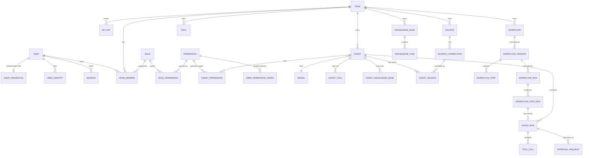

# Database Schema and Design

This document is the reference for TeamAgent's relational schema: what each table is for and why it is shaped the way it is.

**There is no hand-written SQL in this repository.** The schema is defined in the backend as code — Drizzle schema modules — and migrations are generated from it. This document is the *design reference*: what each table is for, why it is shaped that way, and which rules the code must uphold. Once the backend exists, its schema modules are the source of truth for column-level detail; this document stays the source of truth for intent.

An earlier revision embedded a full copy of the DDL here, and the two drifted apart almost immediately — the permission tables described below existed only in prose. Keeping rationale and definition in separate places is deliberate.

Companion documents: `docs/07-permission.md` for the permission vocabulary, `docs/17-threat-model.md` for the trust and provenance columns.

## Design Goals

- support multi-tenancy by team
- separate principals from resources
- keep permissions explicit, scoped, and auditable
- support multiple source integrations per user or team
- give agents narrow, enumerated access to tools, knowledge, and sources
- record execution history in enough detail to investigate an incident

## Core Design Principles

- **Every tenant-scoped table carries `team_id` directly.** Isolation never depends on a join. This costs some denormalization and buys a single, checkable predicate on every query — and keeps Postgres RLS available as an option later.
- **Secrets are never stored here.** `credential_ref` and `webhook_secret_ref` hold vault keys. `api_keys.key_hash` and `refresh_tokens.token_hash` store hashes, never the value. No table holds a recoverable secret.
- **Definitions are versioned; executions reference an immutable version.** Editing a workflow must not change the meaning of a run already in flight.
- **Status columns are `VARCHAR` + `CHECK`, not `ENUM`.** Adding a value is an ordinary migration rather than a type change, and `CHECK` is the one constraint every target engine supports.
- **Ids are generated by the application, not the database.** No `gen_random_uuid()`, no `AUTO_INCREMENT`. Ids are available before insert, which suits a distributed writer and keeps the schema portable.
- **Enforcement that cannot live in the schema is named, not assumed.** See Application Invariants below.
- **Destructive cascades are deliberate.** `ON DELETE CASCADE` only where the child genuinely has no meaning without the parent. Ownership references use `RESTRICT`.

## Recommended Database

**PostgreSQL**, and the reason is not performance: it is the only mainstream engine that can enforce invariants R3 and R4 — the two security rules from `docs/17-threat-model.md` — in the database rather than in application code. On MySQL, MariaDB, or SQLite those two rules rest entirely on application code.

### On multi-engine support

Drizzle does not give you one schema definition across engines. `drizzle-orm/pg-core`, `mysql-core`, and `sqlite-core` are separate packages with separate builders — `pgTable` is not `mysqlTable`. Supporting several engines therefore means maintaining parallel schema definitions or building an abstraction over them, and every extra engine is another testing-matrix entry and another place where R3 and R4 can silently go unenforced.

The recommendation is to pick **one** dialect and stay on it. If the motivation for a second engine is zero-install local development and tests, **PGlite** (`@electric-sql/pglite`) solves that without a second dialect: real Postgres compiled to WASM, running in-process, supported by Drizzle. No Docker, no server, no parallel schema.

If genuine multi-engine support is a product requirement rather than a developer convenience, decide it before the schema modules are written — retrofitting is expensive.

Two version traps worth knowing if another engine is chosen anyway: **MySQL before 8.0.16 and MariaDB before 10.2.1 parse CHECK constraints and silently ignore them**, so every status and tier constraint would do nothing with no error; and **SQLite does not enforce foreign keys** unless `PRAGMA foreign_keys = ON` is set on every connection.

## Domain Model

## Table Reference

31 tables in seven groups.

### Identity — `users`, `user_identities`, `auth_nonces`, `refresh_tokens`

`users` is the canonical human identity and holds profile data only. `email` is nullable and usually absent, because wallet sign-in does not produce one. `token_version` backs the `ver` claim that makes global revocation immediate rather than delayed by the access-token lifetime.

There is no `user_credentials` table. Wallet-only authentication means no password hash, no MFA secret, and no lockout counters to store — see `docs/20-authentication.md`.

`user_identities` implements the linked-account model: one internal user, many provider identities, unique on `(provider, provider_user_id)`. For wallet sign-in, `provider` is `evm_wallet` and `provider_user_id` is the **lowercased** address. Normalization is load-bearing: `0xAbC…` and `0xabc…` are one account, and inconsistent casing silently creates a second identity with no memberships. `chain_id` records the signing chain for audit and EIP-1271 re-verification, but is not part of the identity key, since an EVM address is the same across chains.

`auth_nonces` holds single-use sign-in challenges: `nonce` (unique), `address`, `domain`, `expires_at`, `consumed_at`. Consumption must be an atomic conditional update whose affected-row count is checked — a check-then-update pair leaves a race that lets one signature sign in twice. The table is written by an unauthenticated endpoint, so it needs rate limiting and a cleanup job.

`refresh_tokens` stores opaque refresh tokens by hash, with `family_id`, `replaced_by`, and `revoked_at`. Tokens rotate on every use; presenting an already-rotated token is treated as theft and revokes the whole family. Access tokens are stateless JWTs and are not stored.

### Tenancy — `teams`, `api_keys`

`teams.owner_id` is `ON DELETE RESTRICT`. Deleting a user must never cascade into the destruction of their teams and every agent, workflow, and knowledge base inside them. Ownership transfer is an explicit operation.

`api_keys` are team-scoped machine credentials, stored as a hash plus a display prefix, with optional expiry and revocation.

### Authorization — `permissions`, `roles`, `role_permissions`, `team_members`, `user_permission_grants`

`permissions` is the global catalogue. The full 47-entry list with tiers and role mappings lives in [docs/07-permission.md](07-permission.md); the backend seeds it on first run. Beyond name/resource/action it carries two columns that do real work:

- `risk_tier` — `read_only`, `reply`, `write`, or `admin`. This drives the capability matrix in `docs/17-threat-model.md` C2, where the capabilities available to a run depend on both the grant and the trust level of the run's context.
- `applies_to` — `user`, `agent`, or `both`, enforcing the human/agent separation that `docs/12-security.md` requires.

`roles` are team-scoped, with `team_id IS NULL` marking the five built-in system roles from `docs/02-team.md`. No engine dedupes NULLs in a `UNIQUE` constraint, so system-role name uniqueness is APP INVARIANT R1; Postgres and SQLite recover it with a partial unique index in their dialect file.

`user_permission_grants` and `agent_permissions` use empty-string sentinels for `scope_type` and `scope_id` rather than NULLs, which keeps their `UNIQUE` constraints meaningful on every engine without a partial index.

`team_members.role_id` is a foreign key, not the free-text `VARCHAR` it once was.

`user_permission_grants` covers what roles cannot: resource-scoped overrides, explicit denies, and temporary or delegated access with an expiry — the "direct grants" and "temporary access" cases named in `docs/12-security.md`.

### Models — `models`

Provider-agnostic capability metadata, unique on `(provider, name, version)`.

### Sources — `sources`, `source_connections`

A source is a channel registered in a team; a connection is a concrete endpoint on it (`docs/05-source.md`).

The earlier `owner_type` / `owner_id` pair on `sources` has been removed. It was polymorphic with no foreign key, so it carried no referential integrity, and it was ambiguous against the adjacent `team_id`. Sources are now unambiguously team-scoped, and ownership is expressed on the connection via `owner_scope` (`team` or `user`) with a CHECK requiring `user_id` when the scope is `user`.

`webhook_secret_ref` supports signature verification on inbound webhooks (`docs/17-threat-model.md` T7).

### Tools — `tools`

`team_id IS NULL` marks a system tool available to every team.

`risk_tier` is `NOT NULL` with no default. `docs/17` forbids an implicit `read_only` default, because a tool that silently defaults to the safest tier is exactly the failure mode the tiering exists to prevent.

### Knowledge — `knowledge_bases`, `knowledge_items`

`knowledge_items.trust_level` defaults to `untrusted`. Trust is asserted by a named human (`trusted_by`, `trusted_at`), never inferred by the ingestion pipeline from a domain name or file type. `ingested_from` and `ingested_by` make a poisoned corpus traceable after the fact.

**Known gap:** there is no chunk or embedding table yet, so the ranked semantic retrieval described in `docs/08-knowledge.md` is not yet implementable. That is Phase 5 work; it was left out deliberately rather than guessed at. Note that vector search is the one area where the engines genuinely diverge — `pgvector` on Postgres, native vector types on MySQL 9 and MariaDB 11.7, an extension on SQLite — so this is likely where portability stops being free.

### Agents — `agents`, `agent_permissions`, `agent_tools`, `agent_knowledge_bases`, `agent_sources`

`docs/03-agent.md` states that agents have allowed tools, allowed knowledge bases, and allowed source connections, and that "access must be explicit, scoped, and enforceable." These four join tables are what make that true; previously none of them existed and the claim was prose only.

The rule that no agent may hold a permission whose `risk_tier` is `admin` or whose `applies_to` is `user` — the strongest claim in `docs/17` — cannot be expressed as a CHECK constraint, because it needs a subquery. It is **APP INVARIANT R3**. On PostgreSQL it can be enforced by a trigger shipped in a migration; otherwise it rests on repository-layer code and needs a test of its own.

`agent_sources` is where the egress controls live:

- `can_reply` is reply-to-origin, the cheap default (`docs/17` C4).
- `can_initiate` allows sending elsewhere and requires a non-empty `allowed_destinations`. This is **APP INVARIANT R4**, enforced by CHECK only on Postgres.
- `allowed_destinations` is the allowlist the model cannot expand (`docs/17` C3). The runtime resolves destinations from this list after generation; a proposed destination outside it is denied, never fuzzy-matched.

`agents.budgets` holds the per-run token, tool-count, depth, and wall-clock limits required by `docs/17` C10.

### Workflows — `workflows`, `workflow_versions`, `workflow_steps`, `workflow_runs`, `workflow_step_runs`

The versioning split is the important change. `workflows` is the stable identity and a pointer to the current version; all executable content — trigger, settings, steps — lives on an immutable `workflow_versions` row. `workflow_runs.workflow_version_id` is `NOT NULL` and `RESTRICT`, so a run can always be replayed against what actually executed. Without this, editing a workflow silently changes the semantics of in-flight runs.

`workflow_steps` therefore belongs to a version, not to the workflow.

`workflow_step_runs` is new and serves the per-step status that `docs/15-api.md` promises and `docs/11-runtime.md` requires. It carries `attempt` for retries and `context_trust_level` so taint propagates across step boundaries (`docs/17` T8).

`workflow_runs.idempotency_key` is unique per workflow, satisfying the idempotency guarantee in `docs/11-runtime.md`.

### Execution — `agent_runs`, `tool_calls`

`agent_runs.agent_snapshot` pins the resolved configuration that produced the run: model, prompt, settings, granted tools, destinations. Without it, a run record cannot answer "what instructions caused this?" — and a run's own narrative output is not evidence, because a successful injection can make an agent misreport what it did (`docs/17` T13).

`tool_calls` is the provenance-aware execution record. It stores `context_trust_level`, `risk_tier`, the policy `decision` (`allowed`, `denied`, `approval_required`), `decision_reason`, and the `resolved_destination`. Rows are written *before* execution and updated after, so a crash mid-call still leaves evidence. Denied and pending attempts are recorded, not just successful ones, and `idx_tool_calls_decision` supports querying them directly.

### Governance — `approval_requests`, `audit_logs`

`approval_requests` is the human gate for write-tier actions on untrusted context. `triggering_content` and `triggering_origin` are what make a review meaningful: a reviewer who cannot see that the request originated in a message from an unknown external party cannot make a real decision. `expires_at` is `NOT NULL` — an expired approval is a denial.

`audit_logs` gained `team_id`, without which `GET /teams/:teamId/audit` in `docs/15-api.md` could not be served at all: `resource_id` is polymorphic, so scoping by team would have required a union of joins across every resource type.

`team_id`, `actor_id`, and `resource_id` are intentionally foreign-key-free. Audit rows must survive deletion of the things they describe, and an `ON DELETE SET NULL` on `team_id` would silently unscope a deleted team's entire history. `resource_id` is nullable because events such as a failed login have no resource. `outcome` and `reason` record denials, not only successes.

## Migration Strategy

1. Identity and tenancy: `users`, `user_identities`, `auth_nonces`, `refresh_tokens`, `teams`, `api_keys`.
2. Authorization: `permissions`, `roles`, `role_permissions`, `team_members`, `user_permission_grants`. Seed the catalogue from [docs/07-permission.md](07-permission.md).
3. Models, then agents.
4. Sources, connections, tools, and the `agent_*` scope tables.
5. Knowledge.
6. Workflows and versioning.
7. Execution and governance: runs, step runs, tool calls, approvals, audit.

Migrations are generated by `drizzle-kit` from the schema modules and committed to the repository. Generated SQL is reviewed before it is applied: `drizzle-kit` cannot always tell a rename from a drop-and-add, and the difference is whether a column's data survives.

Three decisions to settle before the first deployment that holds real data, because each is expensive to retrofit:

1. **Partitioning** for `audit_logs`, `tool_calls`, `agent_runs`, and `workflow_step_runs`. These are the highest-write tables in the system — one `tool_calls` row per tool invocation, and agentic runs make many per task. Converting a populated table to a partitioned one is a full rewrite.
2. **Tenant isolation strategy** — repository-layer scoping alone, or PostgreSQL RLS as defense in depth. RLS requires a per-transaction team-context convention across the whole codebase.
3. **The R3 and R4 enforcement path** — a trigger shipped in a migration, or application code plus tests.

## Verification

Schema correctness has to be executed, not reviewed. With Drizzle the fast loop is `drizzle-kit push` against an in-process **PGlite** instance, followed by a test suite asserting that the constraints actually behave: foreign keys reject unknown references, CHECK constraints reject invalid status and trust values, `ON DELETE CASCADE` and `RESTRICT` do what the design says, and R1–R5 hold.

That runs in about a second with no server and no container, and it belongs in CI. Constraint behaviour is exactly the kind of thing that looks obviously correct in review and turns out to be wrong in practice.

## Application Invariants

Five rules the schema cannot enforce on its own. Two are security boundaries from `docs/17-threat-model.md`, and they need tests that attempt the forbidden write and assert that it fails — a code review is not sufficient for a rule this load-bearing.

| | Invariant | Why the schema cannot do it |
|---|---|---|
| **R1** | System role names (`roles.team_id IS NULL`) are unique. | No engine dedupes NULLs in a `UNIQUE` constraint. PostgreSQL and SQLite can recover this with a partial unique index. |
| **R2** | System tool names (`tools.team_id IS NULL`) are unique. | Same reason. |
| **R3** | **[security]** No `agent_permissions` row may reference a permission whose `risk_tier` is `admin` or whose `applies_to` is `user`. | Needs a subquery, and no engine allows one in a CHECK constraint. This is the rule that removes the privilege-escalation class by construction (`docs/17` C2). |
| **R4** | **[security]** `agent_sources.can_initiate = TRUE` requires a non-empty `allowed_destinations`. | Needs JSON introspection inside a constraint. An agent allowed to initiate egress with an empty allowlist may send anywhere — the opposite of the control (`docs/17` C3). |
| **R5** | `workflows.current_version_id` must reference a `workflow_versions` row belonging to that workflow. | It and `workflow_versions.workflow_id` are mutually referential, so the column carries no foreign key. |

`user_permission_grants` and `agent_permissions` use empty-string sentinels for `scope_type` and `scope_id` rather than NULLs, so their `UNIQUE` constraints stay meaningful without a partial index. Without that, the same unscoped grant could be inserted twice.

## Open Questions

1. **Postgres RLS.** Recommended as defense in depth in `docs/17` C12, but it requires a per-transaction team-context convention across the entire codebase. Cheap to adopt now, expensive to retrofit. Only available if PostgreSQL is the chosen engine. Not yet decided.
2. **Which engines to actually support.** The schema is portable across four, but every supported engine is a testing matrix entry and a place where R3 and R4 can silently go unenforced. Supporting fewer engines well may be better than supporting four nominally.
3. **Conversations and messages.** `docs/15-api.md` accepts a `messages[]` array and the permission catalogue is full of `message.*`, but multi-turn state currently has nowhere to live except `agent_runs.input_payload`. A `conversations` / `messages` pair is probably needed before the first interactive agent ships.
4. **Knowledge chunks and embeddings.** See the Knowledge section above.
5. **Retention.** `tool_calls.arguments` and `.result` hold the richest forensic data and the most sensitive payloads. This intersects with the unresolved GDPR erasure-versus-audit-retention question.
6. **Soft delete.** Several tables carry a `deleted` or `archived` status while their foreign keys cascade on hard delete. The two models coexist today; one should be chosen deliberately.

## MVP Scope

Everything in groups 1–4 of the migration strategy, plus `knowledge_bases` / `knowledge_items`, a linear workflow, and the execution and audit tables. That is effectively the whole schema — the permission and provenance tables are not deferrable, because they are the product's stated value proposition rather than a hardening pass to apply later.
