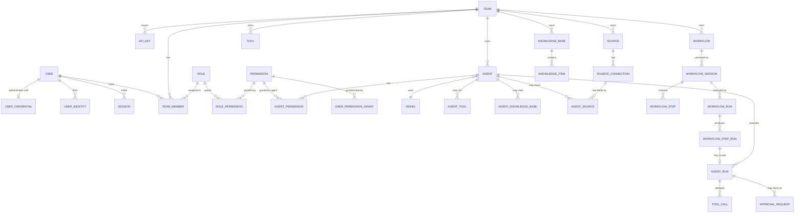

# Database Schema and Design

This document is the reference for TeamAgent's relational schema: what each table is for and why it is shaped the way it is.

**`db/schema.sql` is the single source of truth for the DDL.** This document does not repeat it. An earlier revision embedded a full copy of the DDL here, and the two drifted apart almost immediately — the permission tables described below existed only in prose. Column-level detail belongs in the schema file; the rationale belongs here.

Companion documents: `docs/07-permission.md` for the permission vocabulary, `docs/17-threat-model.md` for the trust and provenance columns.

## Design Goals

- support multi-tenancy by team
- separate principals from resources
- keep permissions explicit, scoped, and auditable
- support multiple source integrations per user or team
- give agents narrow, enumerated access to tools, knowledge, and sources
- record execution history in enough detail to investigate an incident

## Core Design Principles

- **Every tenant-scoped table carries `team_id` directly.** Isolation never depends on a join. This costs some denormalization and buys a single, checkable predicate on every query — and keeps Postgres RLS available as an option later.
- **Secrets are never stored here.** `credential_ref`, `webhook_secret_ref`, and `mfa_secret_ref` hold vault keys. No table has a column for a token, password, or API key value.
- **Definitions are versioned; executions reference an immutable version.** Editing a workflow must not change the meaning of a run already in flight.
- **Status columns are `VARCHAR` + `CHECK`, not `ENUM`.** Adding a value is an ordinary migration rather than a type change.
- **`updated_at` is maintained by trigger.** Application code cannot forget it.
- **Destructive cascades are deliberate.** `ON DELETE CASCADE` only where the child genuinely has no meaning without the parent. Ownership references use `RESTRICT`.

## Recommended Database

PostgreSQL. Foreign keys, JSONB for the genuinely open-ended config blobs, partial and expression indexes, transactional DDL, and `pgvector` available when knowledge retrieval lands.

## Domain Model

## Table Reference

31 tables in seven groups.

### Identity — `users`, `user_credentials`, `user_identities`, `sessions`

`users` is the canonical human identity and holds profile data only. Secret material lives in `user_credentials` (password hash, MFA secret reference, lockout counters), per the separation required by `docs/01-user.md`.

`user_identities` implements the linked-account model: one internal user, many provider identities (Google, GitHub, Telegram, Discord), unique on `(provider, provider_user_id)`. OAuth tokens are referenced, not stored.

`sessions` holds opaque server-side sessions by hash. This is a deliberate choice over stateless JWTs: `docs/15-api.md` specifies a logout endpoint that invalidates the current token, which a stateless JWT cannot honour without a denylist. Opaque sessions are revocable by construction and adequate at expected scale.

### Tenancy — `teams`, `api_keys`

`teams.owner_id` is `ON DELETE RESTRICT`. Deleting a user must never cascade into the destruction of their teams and every agent, workflow, and knowledge base inside them. Ownership transfer is an explicit operation.

`api_keys` are team-scoped machine credentials, stored as a hash plus a display prefix, with optional expiry and revocation.

### Authorization — `permissions`, `roles`, `role_permissions`, `team_members`, `user_permission_grants`

`permissions` is the global catalogue, seeded from `db/seed.sql`. Beyond name/resource/action it carries two columns that do real work:

- `risk_tier` — `read_only`, `reply`, `write`, or `admin`. This drives the capability matrix in `docs/17-threat-model.md` C2, where the capabilities available to a run depend on both the grant and the trust level of the run's context.
- `applies_to` — `user`, `agent`, or `both`, enforcing the human/agent separation that `docs/12-security.md` requires.

`roles` are team-scoped, with `team_id IS NULL` marking the five built-in system roles from `docs/02-team.md`. Two partial unique indexes handle the naming rules, because a plain `UNIQUE(team_id, name)` would not dedupe system roles — Postgres treats NULLs as distinct.

`team_members.role_id` is a foreign key, not the free-text `VARCHAR` it once was.

`user_permission_grants` covers what roles cannot: resource-scoped overrides, explicit denies, and temporary or delegated access with an expiry — the "direct grants" and "temporary access" cases named in `docs/12-security.md`.

### Models — `models`

Provider-agnostic capability metadata, unique on `(provider, name, version)`.

### Sources — `sources`, `source_connections`

A source is a channel registered in a team; a connection is a concrete endpoint on it (`docs/05-source.md`).

The earlier `owner_type` / `owner_id` pair on `sources` has been removed. It was polymorphic with no foreign key, so it carried no referential integrity, and it was ambiguous against the adjacent `team_id`. Sources are now unambiguously team-scoped, and ownership is expressed on the connection via `owner_scope` (`team` or `user`) with a CHECK requiring `user_id` when the scope is `user`.

`webhook_secret_ref` supports signature verification on inbound webhooks (`docs/17-threat-model.md` T7).

### Tools — `tools`

`team_id IS NULL` marks a system tool available to every team.

`risk_tier` is `NOT NULL` with no default. `docs/17` forbids an implicit `read_only` default, because a tool that silently defaults to the safest tier is exactly the failure mode the tiering exists to prevent.

### Knowledge — `knowledge_bases`, `knowledge_items`

`knowledge_items.trust_level` defaults to `untrusted`. Trust is asserted by a named human (`trusted_by`, `trusted_at`), never inferred by the ingestion pipeline from a domain name or file type. `ingested_from` and `ingested_by` make a poisoned corpus traceable after the fact.

**Known gap:** there is no chunk or embedding table yet, so the ranked semantic retrieval described in `docs/08-knowledge.md` is not yet implementable. That is Phase 5 work and will need `pgvector`; it was left out deliberately rather than guessed at.

### Agents — `agents`, `agent_permissions`, `agent_tools`, `agent_knowledge_bases`, `agent_sources`

`docs/03-agent.md` states that agents have allowed tools, allowed knowledge bases, and allowed source connections, and that "access must be explicit, scoped, and enforceable." These four join tables are what make that true; previously none of them existed and the claim was prose only.

`agent_permissions` carries an `ON INSERT OR UPDATE` trigger rejecting any permission whose `risk_tier` is `admin` or whose `applies_to` is `user`. This enforces the strongest claim in `docs/17` — that agents never hold admin capability — at the database rather than trusting every call site.

`agent_sources` is where the egress controls live:

- `can_reply` is reply-to-origin, the cheap default (`docs/17` C4).
- `can_initiate` allows sending elsewhere and requires a non-empty `allowed_destinations`, enforced by CHECK.
- `allowed_destinations` is the allowlist the model cannot expand (`docs/17` C3). The runtime resolves destinations from this list after generation; a proposed destination outside it is denied, never fuzzy-matched.

`agents.budgets` holds the per-run token, tool-count, depth, and wall-clock limits required by `docs/17` C10.

### Workflows — `workflows`, `workflow_versions`, `workflow_steps`, `workflow_runs`, `workflow_step_runs`

The versioning split is the important change. `workflows` is the stable identity and a pointer to the current version; all executable content — trigger, settings, steps — lives on an immutable `workflow_versions` row. `workflow_runs.workflow_version_id` is `NOT NULL` and `RESTRICT`, so a run can always be replayed against what actually executed. Without this, editing a workflow silently changes the semantics of in-flight runs.

`workflow_steps` therefore belongs to a version, not to the workflow.

`workflow_step_runs` is new and serves the per-step status that `docs/15-api.md` promises and `docs/11-runtime.md` requires. It carries `attempt` for retries and `context_trust_level` so taint propagates across step boundaries (`docs/17` T8).

`workflow_runs.idempotency_key` is unique per workflow, satisfying the idempotency guarantee in `docs/11-runtime.md`.

### Execution — `agent_runs`, `tool_calls`

`agent_runs.agent_snapshot` pins the resolved configuration that produced the run: model, prompt, settings, granted tools, destinations. Without it, a run record cannot answer "what instructions caused this?" — and a run's own narrative output is not evidence, because a successful injection can make an agent misreport what it did (`docs/17` T13).

`tool_calls` is the provenance-aware execution record. It stores `context_trust_level`, `risk_tier`, the policy `decision` (`allowed`, `denied`, `approval_required`), `decision_reason`, and the `resolved_destination`. Rows are written *before* execution and updated after, so a crash mid-call still leaves evidence. Denied and pending attempts are recorded, not just successful ones — a partial index supports querying denials directly.

### Governance — `approval_requests`, `audit_logs`

`approval_requests` is the human gate for write-tier actions on untrusted context. `triggering_content` and `triggering_origin` are what make a review meaningful: a reviewer who cannot see that the request originated in a message from an unknown external party cannot make a real decision. `expires_at` is `NOT NULL` — an expired approval is a denial.

`audit_logs` gained `team_id`, without which `GET /teams/:teamId/audit` in `docs/15-api.md` could not be served at all: `resource_id` is polymorphic, so scoping by team would have required a union of joins across every resource type.

`team_id`, `actor_id`, and `resource_id` are intentionally foreign-key-free. Audit rows must survive deletion of the things they describe, and an `ON DELETE SET NULL` on `team_id` would silently unscope a deleted team's entire history. `resource_id` is nullable because events such as a failed login have no resource. `outcome` and `reason` record denials, not only successes.

## Migration Strategy

1. Identity and tenancy: `users`, `user_credentials`, `user_identities`, `sessions`, `teams`, `api_keys`.
2. Authorization: `permissions`, `roles`, `role_permissions`, `team_members`, `user_permission_grants`. Load `db/seed.sql`.
3. Models, then agents.
4. Sources, connections, tools, and the `agent_*` scope tables.
5. Knowledge.
6. Workflows and versioning.
7. Execution and governance: runs, step runs, tool calls, approvals, audit.

No migration tool has been chosen yet. Until one is, `db/schema.sql` is applied whole to an empty database. Pick a tool before the first deployment that holds real data — retrofitting migration history onto a live schema is unpleasant.

## Open Questions

1. **Postgres RLS.** Recommended as defense in depth in `docs/17` C12, but it requires a per-transaction team-context convention across the entire codebase. Cheap to adopt now, expensive to retrofit. Not yet decided.
2. **Conversations and messages.** `docs/15-api.md` accepts a `messages[]` array and the permission catalogue is full of `message.*`, but multi-turn state currently has nowhere to live except `agent_runs.input_payload`. A `conversations` / `messages` pair is probably needed before the first interactive agent ships.
3. **Knowledge chunks and embeddings.** See the Knowledge section above.
4. **Retention.** `tool_calls.arguments` and `.result` hold the richest forensic data and the most sensitive payloads. This intersects with the unresolved GDPR erasure-versus-audit-retention question.
5. **Soft delete.** Several tables carry a `deleted` or `archived` status while their foreign keys cascade on hard delete. The two models coexist today; one should be chosen deliberately.

## MVP Scope

Everything in groups 1–4 of the migration strategy, plus `knowledge_bases` / `knowledge_items`, a linear workflow, and the execution and audit tables. That is effectively the whole schema — the permission and provenance tables are not deferrable, because they are the product's stated value proposition rather than a hardening pass to apply later.
