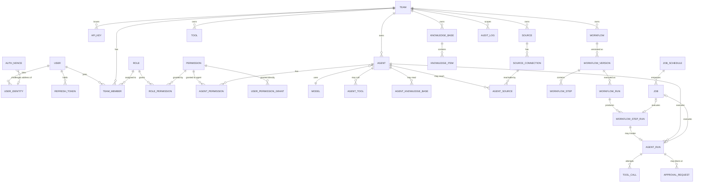

# Database Schema and Design

This document is the reference for NuraAI's relational schema: what each table is for and why it is shaped the way it is.

**There is no hand-written SQL in this repository.** The schema is defined in the backend as code — Drizzle schema modules — and migrations are generated from it. This document is the *design reference*: what each table is for, why it is shaped that way, and which rules the code must uphold. Once the backend exists, its schema modules are the source of truth for column-level detail; this document stays the source of truth for intent.

An earlier revision embedded a full copy of the DDL here, and the two drifted apart almost immediately — the permission tables described below existed only in prose. Keeping rationale and definition in separate places is deliberate.

Companion documents: `docs/07-permission.md` for the permission vocabulary, `docs/17-threat-model.md` for the trust and provenance columns.

## Design Goals

- support multi-tenancy by team
- separate principals from resources
- keep permissions explicit, scoped, and auditable
- support multiple source integrations per user or team
- give agents narrow, enumerated access to tools, knowledge, and sources
- record execution history in enough detail to investigate an incident

## Core Design Principles

- **Every tenant-scoped table carries `team_id` directly.** Isolation never depends on a join. This costs some denormalization and buys a single, checkable predicate on every query — and keeps RLS available as an option.
- **Secrets are never stored here.** `credential_ref` and `webhook_secret_ref` hold vault keys. `api_keys.key_hash` and `refresh_tokens.token_hash` store hashes, never the value. No table holds a recoverable secret.
- **Definitions are versioned; executions reference an immutable version.** Editing a workflow must not change the meaning of a run already in flight.
- **Status columns are `TEXT` + `CHECK`, not `ENUM`.** Adding a value is an ordinary migration rather than an `ALTER TYPE`, and a `CHECK` predicate can be changed and re-validated in one migration where an enum value cannot be removed at all.
- **Ids are UUIDs generated by the application, stored in the native `uuid` type.** No `gen_random_uuid()` default, no `AUTO_INCREMENT` — the id is available before insert, which suits a distributed writer and lets a row and the job that processes it be built in one transaction.
- **Enforcement that a column definition cannot express is named, not assumed.** See Invariants below.
- **Destructive cascades are deliberate.** `ON DELETE CASCADE` only where the child genuinely has no meaning without the parent. Ownership references use `RESTRICT`.

## The Database

**PostgreSQL. One engine, decided.** There is no `DB_DIALECT` switch, no SQLite path, and no portability layer.

The reason is not performance. It is that PostgreSQL is the only mainstream engine that can enforce invariants **R3** and **R4** — the two security rules from `docs/17-threat-model.md` — in the database rather than in application code. On MySQL, MariaDB, or SQLite those two rules rest entirely on repository-layer discipline, which is one refactor away from silently not holding.

### Why not a second engine

An earlier revision supported PostgreSQL and SQLite in parallel. That is now dropped, because the cost was concrete and recurring:

- Drizzle does not abstract over dialects. `drizzle-orm/pg-core` and `sqlite-core` are separate packages with separate builders; `pgTable` is not `sqliteTable` and there is no shared table type. Two engines meant two schema modules kept mechanically parallel, two migration directories, and **every schema change made twice, forever**.
- Every integration test ran twice, and the two runs tested genuinely different things — on PostgreSQL R3 and R4 are database constraints, on SQLite they are application code. They could pass and fail independently.
- SQLite serializes writers. The API, the workers, and the reaper all contend on one write lock, which does not fit the concurrent multi-tenant workload this platform targets.
- Every additional engine is one more place where a security invariant can go unenforced without anyone noticing.

The only argument that survived scrutiny was zero-install local development and testing, and that does not require a second dialect. **PGlite** (`@electric-sql/pglite`) is real PostgreSQL compiled to WASM, running in-process, supported by Drizzle. No Docker, no server, no parallel schema — and the thing being tested is the engine that runs in production.

Committing to one engine also stops the schema having to speak a portable subset. Native `uuid`, `jsonb`, partial and expression indexes, triggers, `SKIP LOCKED`, `LISTEN`/`NOTIFY`, and row-level security are all available and should be used where they earn their place.

**Single-node self-hosting** is not a reason to reintroduce SQLite. PostgreSQL runs fine on one small machine, and a self-hosted deployment that diverges on engine diverges on the two rules that matter most.

## Domain Model

Three of the relationships above are **logical, not foreign keys**, and the diagram cannot show the difference:

- `AUDIT_LOG` — `team_id`, `actor_id`, and `resource_id` carry no foreign key deliberately, so audit rows survive deletion of what they describe.
- `JOB` — references its work by id inside `payload`, so the queue has no structural dependency on any domain table.
- `AUTH_NONCE` — keyed by address, and a nonce may be issued for an address that has never signed in and therefore has no `USER_IDENTITY` row.

## Table Reference

33 tables in twelve groups.

### Identity — `users`, `user_identities`, `auth_nonces`, `refresh_tokens`

`users` is the canonical human identity and holds profile data only. `email` is nullable and usually absent, because wallet sign-in does not produce one. `token_version` backs the `ver` claim that makes global revocation immediate rather than delayed by the access-token lifetime.

There is no `user_credentials` table. Wallet-only authentication means no password hash, no MFA secret, and no lockout counters to store — see `docs/20-authentication.md`.

`user_identities` implements the linked-account model: one internal user, many provider identities, unique on `(provider, provider_user_id)`. For wallet sign-in, `provider` is `evm_wallet` and `provider_user_id` is the **lowercased** address. Normalization is load-bearing: `0xAbC…` and `0xabc…` are one account, and inconsistent casing silently creates a second identity with no memberships. `chain_id` records the signing chain for audit and EIP-1271 re-verification, but is not part of the identity key, since an EVM address is the same across chains.

`auth_nonces` holds single-use sign-in challenges: `nonce` (unique), `address`, `domain`, `expires_at`, `consumed_at`. Consumption must be an atomic conditional update whose affected-row count is checked — a check-then-update pair leaves a race that lets one signature sign in twice. The table is written by an unauthenticated endpoint, so it needs rate limiting and a cleanup job.

`refresh_tokens` stores opaque refresh tokens by hash, with `family_id`, `replaced_by`, and `revoked_at`. Tokens rotate on every use; presenting an already-rotated token is treated as theft and revokes the whole family. Access tokens are stateless JWTs and are not stored.

### Tenancy — `teams`, `api_keys`

`teams.owner_id` is `ON DELETE RESTRICT`. Deleting a user must never cascade into the destruction of their teams and every agent, workflow, and knowledge base inside them. Ownership transfer is an explicit operation.

`api_keys` are team-scoped machine credentials, stored as a hash plus a display prefix, with optional expiry and revocation.

Two columns make the key a principal in the trust model rather than a bypass of it (`docs/17-threat-model.md` T16):

- **`trust_ceiling`** — `untrusted` or `user_input`, **defaulting to `untrusted`**, `NOT NULL`. It caps the trust level of anything submitted through the key. There is deliberately no `trusted` value: content arriving over the network through a shared credential is not authored by a principal with write permission on the resource. The safe behaviour is the one you get by doing nothing.
- **`bound_user_id`** — required when `trust_ceiling` is `user_input`, `NULL` otherwise, enforced by CHECK. A key raised above the default must act for exactly one named human, because `user_input` × `write` in the C2 matrix resolves against *the requesting user's* own grants, and an unbound key has nobody to resolve against.

Issue one key per integration rather than one per team. A shared key collapses to the weakest caller's trust level and makes revocation an outage.

### Authorization — `permissions`, `roles`, `role_permissions`, `team_members`, `user_permission_grants`

`permissions` is the global catalogue. The full 47-entry list with tiers and role mappings lives in [docs/07-permission.md](07-permission.md); the backend seeds it on first run. Beyond name/resource/action it carries two columns that do real work:

- `risk_tier` — `read_only`, `reply`, `write`, or `admin`. This drives the capability matrix in `docs/17-threat-model.md` C2, where the capabilities available to a run depend on both the grant and the trust level of the run's context.
- `applies_to` — `user`, `agent`, or `both`, enforcing the human/agent separation that `docs/12-security.md` requires.

`roles` are team-scoped, with `team_id IS NULL` marking the five built-in system roles from `docs/02-team.md`. A plain `UNIQUE (team_id, name)` does not constrain those rows, because a `UNIQUE` constraint does not dedupe NULLs. A **partial unique index** on `name WHERE team_id IS NULL` closes it — R1 in the invariants table below, and a schema constraint rather than an application rule.

`user_permission_grants` and `agent_permissions` leave `scope_type` and `scope_id` nullable for unscoped grants, with uniqueness enforced by `UNIQUE NULLS NOT DISTINCT` (PostgreSQL 15+). An earlier revision used empty-string sentinels instead, purely so the constraint would behave identically on an engine without that feature; with one engine the sentinel is unnecessary, and a real NULL is the honest representation of "no scope."

`team_members.role_id` is a foreign key, not the free-text `VARCHAR` it once was.

`user_permission_grants` covers what roles cannot: resource-scoped overrides, explicit denies, and temporary or delegated access with an expiry — the "direct grants" and "temporary access" cases named in `docs/12-security.md`.

### Models — `models`

Provider-agnostic capability metadata, unique on `(provider, name, version)`.

### Sources — `sources`, `source_connections`

A source is a channel registered in a team; a connection is a concrete endpoint on it (`docs/05-source.md`).

The earlier `owner_type` / `owner_id` pair on `sources` has been removed. It was polymorphic with no foreign key, so it carried no referential integrity, and it was ambiguous against the adjacent `team_id`. Sources are now unambiguously team-scoped, and ownership is expressed on the connection via `owner_scope` (`team` or `user`) with a CHECK requiring `user_id` when the scope is `user`.

`webhook_secret_ref` supports signature verification on inbound webhooks (`docs/17-threat-model.md` T7).

### Tools — `tools`

`team_id IS NULL` marks a system tool available to every team.

`risk_tier` is `NOT NULL` with no default. `docs/17` forbids an implicit `read_only` default, because a tool that silently defaults to the safest tier is exactly the failure mode the tiering exists to prevent.

### Knowledge — `knowledge_bases`, `knowledge_items`

`knowledge_items.trust_level` defaults to `untrusted`. Trust is asserted by a named human (`trusted_by`, `trusted_at`), never inferred by the ingestion pipeline from a domain name or file type. `ingested_from` and `ingested_by` make a poisoned corpus traceable after the fact.

**Known gap:** there is no chunk or embedding table yet, so the ranked semantic retrieval described in `docs/08-knowledge.md` is not yet implementable. That is Phase 5 work; it was left out deliberately rather than guessed at. When it lands, `pgvector` gives it a native home in the same database as everything else — one of the concrete dividends of committing to a single engine, since vector search is where a portable schema would have stopped being portable.

### Agents — `agents`, `agent_permissions`, `agent_tools`, `agent_knowledge_bases`, `agent_sources`

`docs/03-agent.md` states that agents have allowed tools, allowed knowledge bases, and allowed source connections, and that "access must be explicit, scoped, and enforceable." These four join tables are what make that true; previously none of them existed and the claim was prose only.

The rule that no agent may hold a permission whose `risk_tier` is `admin` or whose `applies_to` is `user` — the strongest claim in `docs/17` — cannot be expressed as a CHECK constraint, because it needs a subquery. It is **APP INVARIANT R3**. On PostgreSQL it can be enforced by a trigger shipped in a migration; otherwise it rests on repository-layer code and needs a test of its own.

`agent_sources` is where the egress controls live:

- `can_reply` is reply-to-origin, the cheap default (`docs/17` C4).
- `can_initiate` allows sending elsewhere and requires a non-empty `allowed_destinations`. This is **APP INVARIANT R4**, enforced by CHECK only on Postgres.
- `allowed_destinations` is the allowlist the model cannot expand (`docs/17` C3). The runtime resolves destinations from this list after generation; a proposed destination outside it is denied, never fuzzy-matched.

`agents.budgets` holds the per-run token, tool-count, depth, and wall-clock limits required by `docs/17` C10.

### Workflows — `workflows`, `workflow_versions`, `workflow_steps`, `workflow_runs`, `workflow_step_runs`

The versioning split is the important change. `workflows` is the stable identity and a pointer to the current version; all executable content — trigger, settings, steps — lives on an immutable `workflow_versions` row. `workflow_runs.workflow_version_id` is `NOT NULL` and `RESTRICT`, so a run can always be replayed against what actually executed. Without this, editing a workflow silently changes the semantics of in-flight runs.

`workflow_steps` therefore belongs to a version, not to the workflow.

`workflow_step_runs` is new and serves the per-step status that `docs/15-api.md` promises and `docs/11-runtime.md` requires. It carries `attempt` for retries and `context_trust_level` so taint propagates across step boundaries (`docs/17` T8).

`workflow_runs.idempotency_key` is unique per workflow, satisfying the idempotency guarantee in `docs/11-runtime.md`.

### Execution — `agent_runs`, `tool_calls`

`agent_runs.agent_snapshot` pins the resolved configuration that produced the run: model, prompt, settings, granted tools, destinations. Without it, a run record cannot answer "what instructions caused this?" — and a run's own narrative output is not evidence, because a successful injection can make an agent misreport what it did (`docs/17` T13).

Beyond that snapshot, `agent_runs` carries `team_id`, `agent_id`, `status`, `context_trust_level`, `input_payload`, `output`, `idempotency_key`, `trace_id`, `error`, `started_at`, and `completed_at`, plus two columns the observability design depends on:

- **`token_usage`** — input, output, and any cached or reasoning token counts as reported by the provider. `docs/22-observability.md` reads it for `tokens_consumed_total`.
- **`cost_estimate`** — the derived spend for the run, stored rather than computed on read, because provider pricing changes and a historical run must keep the cost it actually incurred. Cost is a security signal here, not just a finance one (`docs/17` T12).

`input_payload` is currently the only place multi-turn state can live, which is why a `conversations` / `messages` pair is an open question below.

`tool_calls` is the provenance-aware execution record. It stores `context_trust_level`, `risk_tier`, the policy `decision` (`allowed`, `denied`, `approval_required`), `decision_reason`, and the `resolved_destination`. Rows are written *before* execution and updated after, so a crash mid-call still leaves evidence. Denied and pending attempts are recorded, not just successful ones, and `idx_tool_calls_decision` supports querying them directly.

### Background work — `jobs`, `job_schedules`

There is no broker. Asynchronous work is queued in this same database, which means an enqueue can participate in the transaction that created the work — a workflow run and the job that executes it commit together or not at all. That removes the dual-write failures a separate queue introduces, and it is the main reason the trade is worth making.

`jobs` carries `queue`, `team_id`, `payload`, `status`, `priority`, `run_at`, `attempts`, `max_attempts`, `locked_at`, `locked_by`, `last_error`, `idempotency_key`, `trace_id`, `created_at`, and `completed_at`. Claiming is a single atomic conditional update using `FOR UPDATE SKIP LOCKED`, because a select followed by an update hands one job to two workers, and without `SKIP LOCKED` every worker queues behind the same row.

`locked_at` doubles as a lease heartbeat. The lease must exceed the slowest plausible agent run, or a healthy long-running job is reclaimed and executed twice; this is why `agent_runs.idempotency_key` and `workflow_runs.idempotency_key` exist.

`job_schedules` holds cron triggers. Only one scheduler may tick at a time, or every scheduled workflow fires once per running instance; `pg_try_advisory_lock` around the tick is enough, with no leader-election protocol required.

Both tables need scheduled pruning. An unpruned `jobs` table degrades the claim index and creates sustained vacuum pressure. Full design in `docs/23-job-queue.md`.

### Governance — `approval_requests`, `audit_logs`

`approval_requests` is the human gate for write-tier actions on untrusted context. `triggering_content` and `triggering_origin` are what make a review meaningful: a reviewer who cannot see that the request originated in a message from an unknown external party cannot make a real decision. `expires_at` is `NOT NULL` — an expired approval is a denial.

`audit_logs` gained `team_id`, without which `GET /teams/:teamId/audit` in `docs/15-api.md` could not be served at all: `resource_id` is polymorphic, so scoping by team would have required a union of joins across every resource type.

`team_id`, `actor_id`, and `resource_id` are intentionally foreign-key-free. Audit rows must survive deletion of the things they describe, and an `ON DELETE SET NULL` on `team_id` would silently unscope a deleted team's entire history. `resource_id` is nullable because events such as a failed login have no resource. `outcome` and `reason` record denials, not only successes.

The full column set is `id`, `team_id`, `actor_type`, `actor_id`, `action`, `resource_type`, `resource_id`, `outcome`, `reason`, `metadata`, `ip_address`, `user_agent`, `trace_id`, and `created_at`.

`ip_address` and `user_agent` are what make a sign-in trail investigable, and `ip_address` is the column that quietly breaks if Fastify is not started with `trustProxy` — every row records nginx instead of the caller. See `docs/19-tech-stack.md`.

Both are personal data, and `ip_address` is subject to the same retention question as the rest of this table.

## Migration Strategy

1. Identity and tenancy: `users`, `user_identities`, `auth_nonces`, `refresh_tokens`, `teams`, `api_keys`.
2. Authorization: `permissions`, `roles`, `role_permissions`, `team_members`, `user_permission_grants`. Seed the catalogue from [docs/07-permission.md](07-permission.md).
3. Models, then agents.
4. Sources, connections, tools, and the `agent_*` scope tables.
5. Knowledge.
6. Workflows and versioning.
7. Execution and governance: runs, step runs, tool calls, approvals, audit.

Migrations are generated by `drizzle-kit` from the schema modules and committed to the repository. Generated SQL is reviewed before it is applied: `drizzle-kit` cannot always tell a rename from a drop-and-add, and the difference is whether a column's data survives.

Three decisions to settle before the first deployment that holds real data, because each is expensive to retrofit:

1. **Partitioning** for `audit_logs`, `tool_calls`, `agent_runs`, and `workflow_step_runs`. These are the highest-write tables in the system — one `tool_calls` row per tool invocation, and agentic runs make many per task. Converting a populated table to a partitioned one is a full rewrite.
2. **Tenant isolation strategy** — repository-layer scoping alone, or PostgreSQL RLS as defense in depth. RLS requires a per-transaction team-context convention across the whole codebase.
3. **Whether R3 and R4 are enforced by trigger alone, or by trigger plus a repository-layer check.** The trigger is the boundary; a repository check on top gives a better error message and fails earlier. Belt and braces is cheap here.

## Verification

Schema correctness has to be executed, not reviewed. With Drizzle the fast loop is `drizzle-kit push` against an in-process **PGlite** instance, followed by a test suite asserting that the constraints actually behave: foreign keys reject unknown references, CHECK constraints reject invalid status and trust values, `ON DELETE CASCADE` and `RESTRICT` do what the design says, and R1–R5 hold.

That runs in about a second with no server and no container, and it belongs in CI. Constraint behaviour is exactly the kind of thing that looks obviously correct in review and turns out to be wrong in practice.

## Invariants

Five rules that a plain column definition cannot express. Committing to PostgreSQL moves four of them into the database, where application code cannot bypass them; only R5 remains an application rule.

The numbering **R1–R5 is referenced from `docs/17-threat-model.md`, `docs/18-production-checklist.md`, and `docs/21-testing.md`** and is kept stable even though the enforcement mechanism has changed.

| | Invariant | Enforced by |
|---|---|---|
| **R1** | System role names (`roles.team_id IS NULL`) are unique. | Partial unique index on `name WHERE team_id IS NULL`. A plain `UNIQUE` does not constrain these rows, because it does not dedupe NULLs. |
| **R2** | System tool names (`tools.team_id IS NULL`) are unique. | Same — partial unique index. |
| **R3** | **[security]** No `agent_permissions` row may reference a permission whose `risk_tier` is `admin` or whose `applies_to` is `user`. | **Trigger**, shipped in a migration. The rule needs a subquery, which no engine allows in a CHECK. This is what removes the privilege-escalation class by construction (`docs/17` C2). |
| **R4** | **[security]** `agent_sources.can_initiate = TRUE` requires a non-empty `allowed_destinations`. | **CHECK** using `jsonb_array_length`. An agent allowed to initiate egress with an empty allowlist may send anywhere — the opposite of the control (`docs/17` C3). |
| **R5** | `workflows.current_version_id` must reference a `workflow_versions` row belonging to that workflow. | **Application code.** It and `workflow_versions.workflow_id` are mutually referential, so the column carries no foreign key. |

Being enforced by the database does not remove the need for tests. **R3 and R4 are security boundaries**, and each needs a test that attempts the forbidden write and asserts it fails — a trigger can be dropped by a later migration as silently as a repository check can be refactored away. A code review is not sufficient for a rule this load-bearing. See `docs/21-testing.md`.

Unscoped rows in `user_permission_grants` and `agent_permissions` rely on `UNIQUE NULLS NOT DISTINCT` so that the same unscoped grant cannot be inserted twice.

## Settled

**Which engine to support.** PostgreSQL, exclusively. The dual-dialect design is dropped; see The Database above. R3 and R4 are database constraints as a result, and the schema is free to use native types and Postgres-specific features.

## Open Questions

1. **Postgres RLS.** Recommended as defense in depth in `docs/17` C12, but it requires a per-transaction team-context convention across the entire codebase. Cheap to adopt now, expensive to retrofit. Not yet decided.
2. **Conversations and messages.** `docs/15-api.md` accepts a `messages[]` array and the permission catalogue is full of `message.*`, but multi-turn state currently has nowhere to live except `agent_runs.input_payload`. A `conversations` / `messages` pair is probably needed before the first interactive agent ships.
3. **Knowledge chunks and embeddings.** See the Knowledge section above.
4. **Retention.** `tool_calls.arguments` and `.result` hold the richest forensic data and the most sensitive payloads. This intersects with the unresolved GDPR erasure-versus-audit-retention question.
5. **Soft delete.** Several tables carry a `deleted` or `archived` status while their foreign keys cascade on hard delete. The two models coexist today; one should be chosen deliberately.

## MVP Scope

Everything in groups 1–4 of the migration strategy, plus `knowledge_bases` / `knowledge_items`, a linear workflow, and the execution and audit tables. That is effectively the whole schema — the permission and provenance tables are not deferrable, because they are the product's stated value proposition rather than a hardening pass to apply later.
