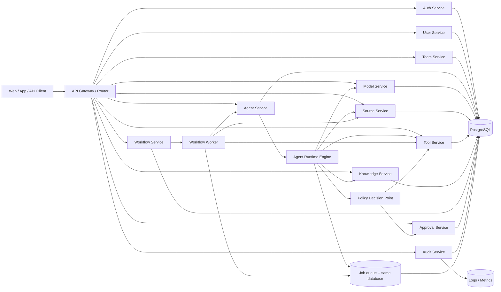
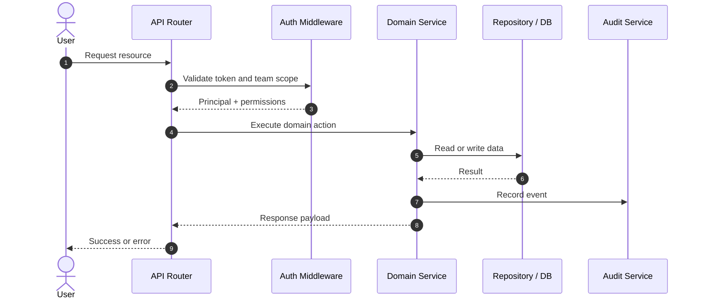

# Backend Architecture and Service Breakdown

This document defines the initial backend structure for NuraAI. The focus is on a clean, implementable architecture that supports multi-tenancy, secure access control, agent execution, workflows, and external integrations without overcomplicating the first version.

## High-Level Architecture



## Recommended Runtime Stack

For a first production-friendly implementation, use:
- Fastify + TypeScript
- PostgreSQL, the sole supported engine, with the schema defined in code via Drizzle
- a single database; the job queue lives in it, with no broker or cache alongside
- object storage for files and documents
- Secret Manager / Vault for credentials
- OpenTelemetry for logs and tracing

## Core Services

### 1. Auth Service
Owns authentication and identity validation.

Responsibilities:
- EIP-4361 nonce issuance and signature verification
- access token issuance, refresh token rotation and reuse detection
- wallet identity resolution and linking
- principal context building: `token_version` check plus permission resolution, cached per request
- API key verification, and resolution of the key `trust_ceiling` and `bound_user_id` into the request principal, so the ingress trust label is set before any handler runs (`docs/17-threat-model.md` T16)

Permissions are resolved per request and never carried in the token — see `docs/20-authentication.md`.

Dependencies:
- database
- secret manager
- an EVM RPC endpoint, for EIP-1271 smart-contract wallet verification. This is a dependency in the authentication path: it needs a timeout and must fail closed.

### 2. User Service
Owns human profile management.

Responsibilities:
- user CRUD
- profile and preferences
- team membership lookup
- activity tracking

### 3. Team Service
Owns team lifecycle and membership governance.

Responsibilities:
- create/update/archive team
- add/remove members
- role assignment
- team settings and usage limits
- ownership and access validation

### 4. Agent Service
Owns agent configuration and lifecycle.

Responsibilities:
- create/update/delete agent
- attach model and settings
- manage agent permissions
- link to knowledge and sources
- track agent versions or revisions when needed

### 5. Model Service
Owns capability metadata and model registry.

Responsibilities:
- list available models
- read provider metadata
- validate selected model for an agent
- record cost/usage metadata

### 6. Source Service
Owns integration configuration and lifecycle.

Responsibilities:
- register sources and source connections
- maintain source metadata and connection state
- validate credentials and provider health
- expose connection capabilities to agents and workflows

### 7. Tool Service
Owns tool registration, validation, and execution policies.

Responsibilities:
- register tool definitions
- validate input schema
- enforce permission checks
- grant or deny tool execution
- access execution logs

### 8. Knowledge Service
Owns knowledge ingestion, indexing, and retrieval.

Responsibilities:
- create knowledge base
- ingest documents or content
- index and store metadata
- search relevant content for an agent
- enforce access control on retrieval

### 9. Workflow Service
Owns automation definition and orchestration.

Responsibilities:
- create workflow definitions
- define trigger configuration
- store workflow step graph
- start and monitor workflow execution
- handle retries and error paths

### 10. Workflow Worker
Runs async workflow tasks and step executions.

Responsibilities:
- poll jobs from a queue
- execute agent runs and tool calls
- evaluate conditions and branching
- mark outcome as succeeded or failed
- emit event records to audit and monitoring

### 11. Agent Runtime Engine
Runs the actual interactive or async agent task.

Responsibilities:
- select model
- load system prompt
- fetch permitted knowledge
- apply tool access policy
- call model provider
- return result and logs

### 12. Approval Service
Owns the human gate for `write`-tier actions proposed on untrusted context (`docs/17-threat-model.md` C5).

Responsibilities:
- open an approval request when the policy decision point returns `approval_required`, capturing the proposed action, the resolved destination, the triggering content, and its origin
- suspend the run and resume it on a decision
- enforce expiry — an expired approval is a denial, never a request that waits
- deliver notifications through the configured channel
- record every decision in the audit log

Dependencies:
- database
- a notification channel

**The notification channel is an unresolved dependency.** `users.email` is nullable and usually absent under wallet sign-in (`docs/20-authentication.md`), so approvals cannot be assumed deliverable by email. This must be decided before the service is built, not after.

### 13. Audit Service
Owns all recorded operational and security events.

Responsibilities:
- record user and agent actions
- log access decisions
- track source/tool execution events
- support incident investigation
- provide event queries for admins

## Shared Modules

These modules should be reused across services:

### 1. Auth & Authorization Layer
- token verification
- permission resolver
- team/member context
- resource access policy

### 2. Validation Layer
- request validation
- schema validation for tool inputs
- event payload validation

### 3. Observability Layer
- request tracing
- execution logs
- metrics collection
- alerts and health status

### 4. Error Handling Layer
- standard error codes
- retry classification
- safe failure messages

### 5. Secret Management Layer
- token and credential storage
- rotation support
- encrypted secret references

## Recommended Folder Structure

```text
backend/
  app/
    api/
      routes/
      middleware/
      controllers/
    services/
      auth/
      api-keys/         # issue, revoke, resolve trust_ceiling
      users/
      teams/
      agents/
        grants/         # tools, knowledge, sources, allowed_destinations
      models/
      sources/
      tools/
      knowledge/
      workflows/
      approvals/
      audit/
    runtime/
      agent-runtime/
      workflow-worker/
      policy/           # THE policy decision point -- see below
    core/
      config/
      logger/
      errors/
      security/
      validation/
      observability/
    infra/
      db/
        schema/          # one module per table group
        migrations/      # generated by drizzle-kit, reviewed, committed
      queue/             # claim, heartbeat, reap, schedule -- backed by db
      storage/
      secrets/
    types/
      domain/
      api/
  tests/
    unit/
    integration/
    e2e/

frontend/
  src/
    app/
    components/
    features/
    lib/
      wallet/            # wagmi config, SIWE message construction
      api/
    locales/
      en/
      fa/
  index.html
```

The frontend is a separate build artifact. nginx serves it; the API does not.

### `runtime/policy/` deserves its own directory

It is the smallest module in the backend and the most security-critical. It answers one question — given an agent grants, a tool `risk_tier`, and the effective context trust, is this call allowed, denied, or does it need an approval — and it is the boundary that every other control depends on.

Three properties follow from giving it a home of its own:

- **It is a pure function.** No database, no network, no clock. That makes all twelve cells of the capability matrix testable in milliseconds, and `docs/21-testing.md` requires exactly that.
- **It has one caller that matters.** The tool runtime, immediately before execution. A check anywhere earlier is advisory; burying this logic inside `agent-runtime/` invites a second, divergent copy at configuration time.
- **It should be readable in one sitting.** If it grows dependencies, something has been pushed into it that belongs outside.

Putting it under `core/security/` alongside crypto helpers would work, and is how it quietly becomes a utility function that someone inlines for convenience.

## Service Interaction Model

### User Request Flow



### Agent Execution Flow

```mermaid
sequenceDiagram
    autonumber
    participant Client as Client / Workflow
    participant AgentSvc as Agent Service
    participant Runtime as Agent Runtime
    participant Knowledge as Knowledge Service
    participant Model as Model Provider
    participant Tool as Tool Engine
    participant Audit as Audit Service

    Client->>AgentSvc: Start agent run
    AgentSvc->>Runtime: Build execution context
    Runtime->>Knowledge: Fetch allowed knowledge
    Knowledge-->>Runtime: Relevant context, per-chunk trust
    Runtime->>Runtime: Effective trust = minimum; pin agent_snapshot

    loop until no tool is requested, or a budget is exhausted
        Runtime->>Model: Invoke with assembled context
        Model-->>Runtime: Response, or a requested tool call
        Runtime->>Tool: Policy decision, then execute if allowed
        Tool->>Audit: Write tool_calls row before executing
        Tool-->>Runtime: Result, labelled untrusted
        Runtime->>Runtime: Recompute trust — may only decrease
    end

    Runtime->>Audit: Log run status from the execution path
    Runtime-->>AgentSvc: Final result
    AgentSvc-->>Client: Run response
```

The loop and its ordering are load-bearing. The model chooses the tool, so a tool call cannot precede the first inference; the policy decision point sits inside the Tool Engine immediately before execution rather than in the Agent Service at configuration time; and each result returns as `untrusted`, which can only lower the context trust for the next iteration. `docs/11-runtime.md` has the detailed version and `docs/17-threat-model.md` has the reasoning.

## Permission Enforcement Strategy

Permission checks should happen in three places:

1. API middleware or route guard
2. service-level domain validation
3. runtime-level tool and source enforcement

This layered approach prevents accidental bypass and keeps the model safe.

## Execution Queue Strategy

Use a queue for:
- workflow jobs
- long-running agent tasks
- external source ingestion
- delayed tasks and retries

Recommended queue pattern:
- enqueue the job inside the same transaction as the domain write
- worker claims it with a single atomic conditional update
- worker heartbeats its lease while running
- worker updates status and emits events
- a reaper returns jobs from crashed workers
- audit logs stored after job completion

The claim query and lease semantics are easy to get subtly wrong — a select followed by an update hands one job to two workers, and a lease shorter than a real agent run reclaims and reruns healthy work. See `docs/23-job-queue.md`.

## Error Handling Model

Define a consistent failure taxonomy:
- `UNAUTHORIZED`
- `FORBIDDEN`
- `NOT_FOUND`
- `INVALID_INPUT`
- `RATE_LIMITED`
- `EXTERNAL_PROVIDER_ERROR`
- `TOOL_EXECUTION_FAILED`
- `WORKFLOW_TIMEOUT`
- `INTERNAL_SERVER_ERROR`

## Observability Requirements

Every request and execution should produce:
- request ID
- trace ID
- user or service actor ID
- team scope
- resource ID
- status and event timeline
- latency and resource usage

## MVP Backend Scope

For the first version, keep the backend strictly focused on:
- auth and user identity
- team membership and roles
- agent creation and execution
- model registry and selection
- source registration and safe connect flow
- one or two basic tools
- basic knowledge retrieval
- one workflow engine with linear steps
- audit log collection

## Recommended Tech Decisions for MVP

- Fastify + TypeScript. Native JSON Schema validation serves both HTTP routes and tool-argument validation (`docs/17-threat-model.md` C7), keeping one validation path rather than two.
- PostgreSQL, and only PostgreSQL, for all relational data in every environment. It is the only mainstream engine that can enforce invariants R3 and R4 — the two security rules from `docs/17-threat-model.md` — in the database rather than in application code, and a second engine would mean an environment where they are enforced more weakly than in production.
- Drizzle for the schema and migrations, defined in code under `app/infra/db/` using `drizzle-orm/pg-core`. With one engine the schema is free to use native `uuid` and `jsonb`, partial indexes, triggers, and `SKIP LOCKED` rather than a portable subset. See `docs/14-database.md`.
- PGlite for local development and tests: real Postgres in-process, no server and no container, so schema tests run in about a second in CI. This is what replaced SQLite, and it tests the production engine rather than an approximation of it.
- No Redis and no broker. The job queue is a table in the same database; see `docs/23-job-queue.md`. Enqueue happens inside the domain transaction, which removes the dual-write failures a separate broker introduces.
- No permission cache. Resolution is a per-request indexed join, which keeps revocation immediate.
- React + Vite + TailwindCSS for the frontend, built to static assets and served by nginx
- react-i18next for English and Persian, with RTL handled through Tailwind logical properties
- wagmi + viem on the client, viem on the server, so message construction and signature verification share types
- structured JSON for configs and runtime metadata
- env-based config with secret manager integration, validated at startup

**TLS and CORS are handled by nginx and must not appear in this codebase** — no HTTPS listener, no `@fastify/cors`. Fastify must run with `trustProxy` set to the proxy address, or `request.ip` is the proxy on every request and both audit attribution and rate limiting break quietly. See `docs/19-tech-stack.md`.

## Final Recommendation

The backend should be designed around explicit boundaries:
- identity layer
- team and permission layer
- execution layer
- workflow layer
- integration layer
- audit and monitoring layer

This separation makes the system easier to secure, test, and evolve as the project grows.
