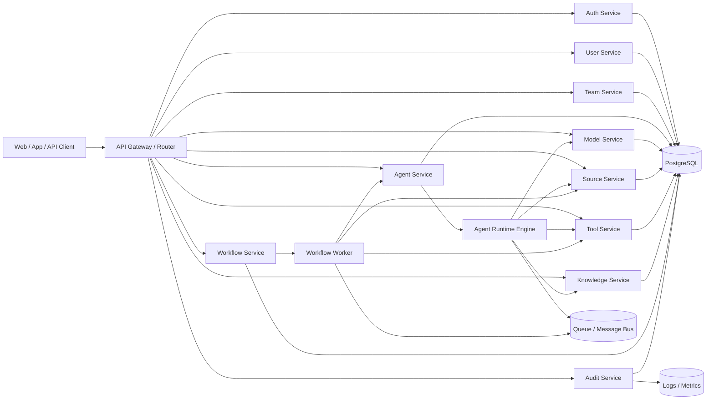
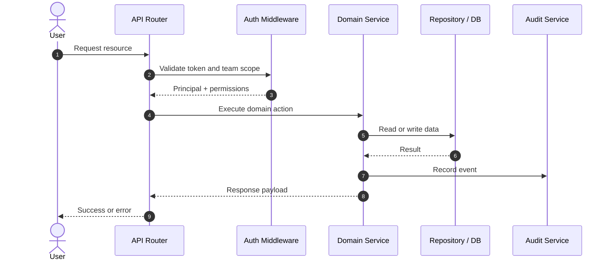
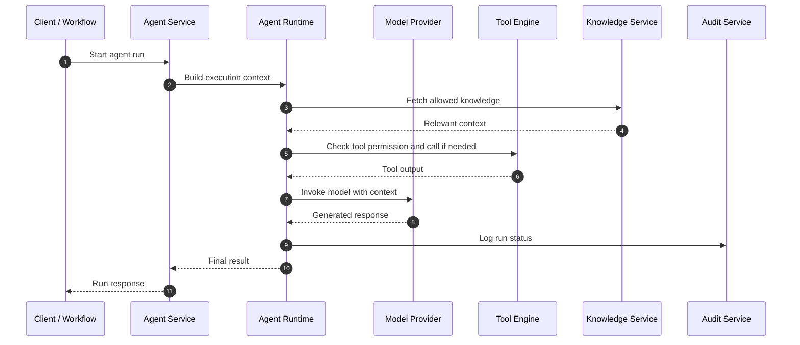

# Backend Architecture and Service Breakdown

This document defines the initial backend structure for TeamAgent. The focus is on a clean, implementable architecture that supports multi-tenancy, secure access control, agent execution, workflows, and external integrations without overcomplicating the first version.

## High-Level Architecture



## Recommended Runtime Stack

For a first production-friendly implementation, use:
- Fastify + TypeScript
- PostgreSQL or SQLite, selected by `DB_DIALECT`, with the schema defined in code via Drizzle
- Redis for caching and job orchestration
- RabbitMQ or BullMQ for async jobs
- object storage for files and documents
- Secret Manager / Vault for credentials
- OpenTelemetry for logs and tracing

## Core Services

### 1. Auth Service
Owns authentication and identity validation.

Responsibilities:
- EIP-4361 nonce issuance and signature verification
- access token issuance, refresh token rotation and reuse detection
- wallet identity resolution and linking
- principal context building: `token_version` check plus permission resolution, cached per request

Permissions are resolved per request and never carried in the token — see `docs/20-authentication.md`.

Dependencies:
- database
- secret manager
- an EVM RPC endpoint, for EIP-1271 smart-contract wallet verification. This is a dependency in the authentication path: it needs a timeout and must fail closed.

### 2. User Service
Owns human profile management.

Responsibilities:
- user CRUD
- profile and preferences
- team membership lookup
- activity tracking

### 3. Team Service
Owns team lifecycle and membership governance.

Responsibilities:
- create/update/archive team
- add/remove members
- role assignment
- team settings and usage limits
- ownership and access validation

### 4. Agent Service
Owns agent configuration and lifecycle.

Responsibilities:
- create/update/delete agent
- attach model and settings
- manage agent permissions
- link to knowledge and sources
- track agent versions or revisions when needed

### 5. Model Service
Owns capability metadata and model registry.

Responsibilities:
- list available models
- read provider metadata
- validate selected model for an agent
- record cost/usage metadata

### 6. Source Service
Owns integration configuration and lifecycle.

Responsibilities:
- register sources and source connections
- maintain source metadata and connection state
- validate credentials and provider health
- expose connection capabilities to agents and workflows

### 7. Tool Service
Owns tool registration, validation, and execution policies.

Responsibilities:
- register tool definitions
- validate input schema
- enforce permission checks
- grant or deny tool execution
- access execution logs

### 8. Knowledge Service
Owns knowledge ingestion, indexing, and retrieval.

Responsibilities:
- create knowledge base
- ingest documents or content
- index and store metadata
- search relevant content for an agent
- enforce access control on retrieval

### 9. Workflow Service
Owns automation definition and orchestration.

Responsibilities:
- create workflow definitions
- define trigger configuration
- store workflow step graph
- start and monitor workflow execution
- handle retries and error paths

### 10. Workflow Worker
Runs async workflow tasks and step executions.

Responsibilities:
- poll jobs from a queue
- execute agent runs and tool calls
- evaluate conditions and branching
- mark outcome as succeeded or failed
- emit event records to audit and monitoring

### 11. Agent Runtime Engine
Runs the actual interactive or async agent task.

Responsibilities:
- select model
- load system prompt
- fetch permitted knowledge
- apply tool access policy
- call model provider
- return result and logs

### 12. Audit Service
Owns all recorded operational and security events.

Responsibilities:
- record user and agent actions
- log access decisions
- track source/tool execution events
- support incident investigation
- provide event queries for admins

## Shared Modules

These modules should be reused across services:

### 1. Auth & Authorization Layer
- token verification
- permission resolver
- team/member context
- resource access policy

### 2. Validation Layer
- request validation
- schema validation for tool inputs
- event payload validation

### 3. Observability Layer
- request tracing
- execution logs
- metrics collection
- alerts and health status

### 4. Error Handling Layer
- standard error codes
- retry classification
- safe failure messages

### 5. Secret Management Layer
- token and credential storage
- rotation support
- encrypted secret references

## Recommended Folder Structure

```text
backend/
  app/
    api/
      routes/
      middleware/
      controllers/
    services/
      auth/
      users/
      teams/
      agents/
      models/
      sources/
      tools/
      knowledge/
      workflows/
      audit/
    runtime/
      agent-runtime/
      workflow-worker/
    core/
      config/
      logger/
      errors/
      security/
      validation/
      observability/
    infra/
      db/
        schema/          # pg.ts and sqlite.ts, kept mechanically parallel
        migrations/      # one directory per dialect
      redis/
      queue/
      storage/
      secrets/
    types/
      domain/
      api/
  tests/
    unit/
    integration/
    e2e/

frontend/
  src/
    app/
    components/
    features/
    lib/
      wallet/            # wagmi config, SIWE message construction
      api/
    locales/
      en/
      fa/
  index.html
```

The frontend is a separate build artifact. nginx serves it; the API does not.

## Service Interaction Model

### User Request Flow



### Agent Execution Flow



## Permission Enforcement Strategy

Permission checks should happen in three places:

1. API middleware or route guard
2. service-level domain validation
3. runtime-level tool and source enforcement

This layered approach prevents accidental bypass and keeps the model safe.

## Execution Queue Strategy

Use a queue for:
- workflow jobs
- long-running agent tasks
- external source ingestion
- delayed tasks and retries

Recommended queue pattern:
- enqueue event/job
- worker consumes job
- worker updates status and emits events
- audit logs stored after job completion

## Error Handling Model

Define a consistent failure taxonomy:
- `UNAUTHORIZED`
- `FORBIDDEN`
- `NOT_FOUND`
- `INVALID_INPUT`
- `RATE_LIMITED`
- `EXTERNAL_PROVIDER_ERROR`
- `TOOL_EXECUTION_FAILED`
- `WORKFLOW_TIMEOUT`
- `INTERNAL_SERVER_ERROR`

## Observability Requirements

Every request and execution should produce:
- request ID
- trace ID
- user or service actor ID
- team scope
- resource ID
- status and event timeline
- latency and resource usage

## MVP Backend Scope

For the first version, keep the backend strictly focused on:
- auth and user identity
- team membership and roles
- agent creation and execution
- model registry and selection
- source registration and safe connect flow
- one or two basic tools
- basic knowledge retrieval
- one workflow engine with linear steps
- audit log collection

## Recommended Tech Decisions for MVP

- Fastify + TypeScript. Native JSON Schema validation serves both HTTP routes and tool-argument validation (`docs/17-threat-model.md` C7), keeping one validation path rather than two.
- PostgreSQL for core relational data. It is the only mainstream engine that can enforce application invariants R3 and R4 — the two security rules from `docs/17-threat-model.md` — in the database rather than in application code.
- Drizzle for the schema and migrations, defined in code under `app/infra/db/`. Note that Drizzle's dialect packages are separate and not interchangeable (`pg-core` is not `mysql-core`), so the engine choice is made once, in the schema modules. See `docs/14-database.md`.
- PGlite for local development and tests: real Postgres in-process, no server and no container, so schema tests run in about a second in CI.
- Redis for queue and caching
- BullMQ for async execution
- React + Vite + TailwindCSS for the frontend, built to static assets and served by nginx
- react-i18next for English and Persian, with RTL handled through Tailwind logical properties
- wagmi + viem on the client, viem on the server, so message construction and signature verification share types
- structured JSON for configs and runtime metadata
- env-based config with secret manager integration, validated at startup

**TLS and CORS are handled by nginx and must not appear in this codebase** — no HTTPS listener, no `@fastify/cors`. Fastify must run with `trustProxy` set to the proxy address, or `request.ip` is the proxy on every request and both audit attribution and rate limiting break quietly. See `docs/19-tech-stack.md`.

## Final Recommendation

The backend should be designed around explicit boundaries:
- identity layer
- team and permission layer
- execution layer
- workflow layer
- integration layer
- audit and monitoring layer

This separation makes the system easier to secure, test, and evolve as the project grows.
