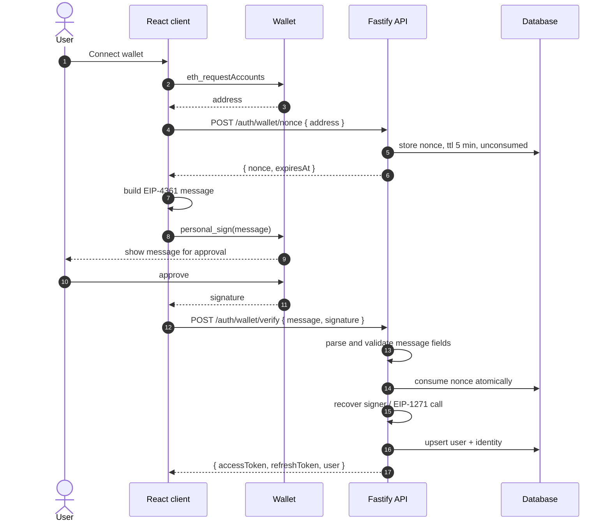

# Authentication

NuraAI authenticates humans with an **EVM wallet signature (EIP-4361, "Sign-In With Ethereum")** and issues a **short-lived JWT access token plus a revocable refresh token**.

There is no password authentication. `docs/12-security.md` previously listed email/password and SSO as options; this document supersedes that for human sign-in.

API keys remain the mechanism for machine-to-machine access, but they are **not unchanged**: `docs/17-threat-model.md` T16 gives every key a `trust_ceiling` that defaults to `untrusted`, because authenticating a machine principal establishes who is calling and says nothing about whether the content it carries is safe to act on. See API keys below.

## What wallet-only changes

Removing passwords removes a large amount of attack surface — no credential stuffing, no password reset flow, no breach-reuse exposure, no password storage to get wrong. That is a genuine security improvement and the main argument for this design.

It also removes the recovery path. Three consequences that need decisions, not just awareness:

1. **A lost wallet is a lost account.** There is no reset email. Recovery has to be designed deliberately — a second linked wallet, a team-owner-initiated transfer, or an explicit admin process — and it should exist before the first real user signs up. `teams.owner_id` is `ON DELETE RESTRICT`, so an unrecoverable owner account also locks its team.
2. **`users.email` is nullable and will often be empty.** The approval gates in `docs/17-threat-model.md` C5 assume a reviewer can be reached. If approvals are delivered by email, wallet-only users cannot receive them. Decide the notification channel before building approvals.
3. **A wallet address is a permanent, public, cross-site identifier.** Unlike an email address, it is already linked to a public transaction history that anyone can read. Storing it alongside team membership and audit records creates a correlation surface that a conventional account does not. This matters for the privacy and retention questions in `docs/14-database.md`, and it means `user_identities.provider_user_id` should be treated as personal data.

## Sign-in flow



## The message

EIP-4361 format. The client builds it; the server re-parses and validates every field rather than trusting the client's construction.

```text
app.example.com wants you to sign in with your Ethereum account:
0xAbC0000000000000000000000000000000000123

Sign in to NuraAI. This request will not trigger a transaction
or cost any gas.

URI: https://app.example.com
Version: 1
Chain ID: 1
Nonce: 8f4kd92jaKx1mQ
Issued At: 2026-09-16T00:00:00.000Z
Expiration Time: 2026-09-16T00:05:00.000Z
```

The statement line is a security control, not decoration. It is what the user reads in their wallet before approving, and it is the only thing standing between them and a signature request from a malicious site. Name the application and say plainly that no transaction is involved.

## Verification

Order matters: cheap structural checks first, cryptography last. A malformed or replayed request should be rejected before it costs an elliptic-curve operation or an RPC round trip.

1. **Parse the message** with a real EIP-4361 parser. Reject anything malformed. Do not regex fields out of a free-form string — a permissive parser is how field-injection bugs happen.
2. **`domain` must equal `SIWE_DOMAIN` exactly.** String equality, not `endsWith`, not a suffix or subdomain match. `evil-app.example.com` ends with `app.example.com`, and treating that as a match hands an attacker valid sign-ins.
3. **`uri` must match `SIWE_URI`.**
4. **`chainId` must equal `SIWE_CHAIN_ID`.** Without this, a signature obtained in a testnet context is replayable against mainnet.
5. **`issuedAt` is recent and `expirationTime` has not passed.** Allow small clock skew, not unbounded.
6. **The nonce exists, is unconsumed, is unexpired, and was issued to this address.**
7. **Consume the nonce atomically**, before verifying the signature:
   ```sql
   UPDATE auth_nonces SET consumed_at = <now>
    WHERE nonce = ? AND consumed_at IS NULL AND expires_at > <now>
   ```
   Proceed only if exactly one row was affected. Check-then-update in two statements leaves a race in which two concurrent requests both pass the check and both sign in on one signature.
8. **Verify the signature** — see below.
9. **The recovered signer must equal the address in the message.** Compare normalized.
10. **Upsert** the user and identity, then issue tokens.

Every failed attempt is an `audit_logs` row with `outcome = 'denied'` and a reason. Sign-in failures are exactly the signal an intrusion investigation needs.

### EOA versus smart-contract wallets

**Externally owned accounts** (MetaMask, Rainbow, hardware wallets) sign with a private key. Recover the signer from the EIP-191 personal-sign hash and compare.

**Smart-contract wallets** (Safe, Argent, most account-abstraction wallets) have no private key. Verification is **EIP-1271**: call `isValidSignature(bytes32 hash, bytes signature)` on the wallet contract and require the magic return value `0x1626ba7e`.

This is not optional in practice — Safe alone represents a large share of team and treasury accounts, and they cannot sign in without it.

It also introduces something worth naming: **an RPC node becomes a dependency in the authentication path.** That means:

- `EVM_RPC_URL` must be set, pinned, and trusted. A compromised or hostile RPC can assert that any signature is valid for any contract.
- The call needs a timeout, and failure must **fail closed** — deny the sign-in. An RPC timeout that falls through to "allow" is an authentication bypass.
- The contract is chain-specific, so `chainId` verification is load-bearing here rather than merely tidy.

`EIP-6492` covers counterfactual wallets that have not been deployed yet. Support it only if those users actually exist for you; it adds meaningful complexity.

### Address normalization

Store addresses **lowercased**. Display them EIP-55 checksummed.

`0xAbC...` and `0xabc...` are the same account. If normalization is inconsistent, `UNIQUE (provider, provider_user_id)` will happily create two identities for one wallet, and the second one arrives with no team memberships and no permissions — a support problem that looks like data loss. Normalize at the boundary, once.

## Tokens

### Access token

A JWT, **15 minutes**, stateless.

```json
{
  "sub": "<user id>",
  "ver": 3,
  "jti": "<token id>",
  "iat": 1789555200,
  "exp": 1789556100
}
```

`HS256` is adequate while one service both issues and verifies. Move to `EdDSA` or `ES256` if verification ever happens outside the issuing process — a worker, an edge function, a second service — so that a verifier never needs the signing secret.

### Permissions are not in the token

This is the most important decision in this document, and it is easy to get wrong because putting roles in the JWT is the common pattern.

`docs/07-permission.md` and `docs/12-security.md` both require that access be revoked **immediately** when membership or grants change, and that sensitive actions be checked at the moment they happen rather than at issuance. A permission baked into a 15-minute token contradicts both: a member removed from a team keeps acting for up to fifteen more minutes, with every check passing.

So the token carries **identity only**. Permissions, team memberships, and roles are resolved per request.

That resolution is a database read, which is the usual objection. Two things make it a non-issue here: it is an indexed join returning a small row set on a connection that is already open, and the request already needs a principal-context load to check `ver` (below), so the permission lookup rides along with a query that was happening anyway. The model call in the same request takes three orders of magnitude longer.

Do not put a TTL cache in front of it. A cache without an invalidation channel reintroduces exactly the staleness this section exists to prevent — it is the JWT-claims defect relocated. See `docs/23-job-queue.md`.

### The `ver` claim

`users.token_version` increments on suspension, on wallet unlinking, and on any forced global sign-out. A token whose `ver` does not match the current value is rejected.

This is what makes "revoke access now" actually mean now, rather than "within fifteen minutes". It is checked against the same cached principal context as permissions.

### Refresh token

Opaque random bytes — **not** a JWT — stored only as a hash, valid for 30 days.

- **Rotated on every use.** The old token is marked replaced and the client receives a new one.
- **Reuse is treated as compromise.** If a token that has already been rotated is presented, the entire token family is revoked and `token_version` is incremented. A legitimate client never replays a rotated token; an attacker replaying a stolen one does. This turns theft into a detectable event rather than a silent persistent session.
- Rows carry `family_id`, `expires_at`, `revoked_at`, `replaced_by`, plus IP and user agent for forensics.

### Logout

Logout revokes the refresh token family. The access token is stateless and lives out its remaining lifetime — **up to 15 minutes**.

That window is the honest cost of stateless tokens, and it is precisely why the access TTL is short and why `ver` exists. For an immediate global cut-off, increment `token_version`.

`docs/15-api.md` previously described `POST /auth/logout` as invalidating the current token. With a stateless JWT that was not achievable as written; this is the corrected design.

## Endpoints

| Endpoint | Purpose |
|---|---|
| `POST /auth/wallet/nonce` | `{ address }` → `{ nonce, expiresAt }`. Rate limited per address and per IP. |
| `POST /auth/wallet/verify` | `{ message, signature }` → `{ accessToken, refreshToken, user }`. Strictly rate limited. |
| `POST /auth/refresh` | `{ refreshToken }` → new pair. Rotates; detects reuse. |
| `POST /auth/logout` | Revokes the presented token's family. |
| `GET /auth/me` | Current user, linked wallets, active teams. |

`POST /auth/login` is removed. There is no password to post.

**Rate limiting matters on the nonce endpoint specifically.** It is unauthenticated and it writes a row, so it is a free database-growth primitive for anyone who finds it. Limit per address and per IP — which requires `trustProxy` to be configured, per `docs/19-tech-stack.md`.

## Schema support

Changes to the design in `docs/14-database.md`:

| Change | Reason |
|---|---|
| **Drop `user_credentials`** | No passwords, no MFA secret, no lockout counters. The table has no remaining purpose. |
| **`sessions` → `refresh_tokens`** | Adds `family_id`, `replaced_by`, `revoked_at` for rotation and reuse detection. |
| **New `auth_nonces`** | `nonce` (unique), `address`, `domain`, `expires_at`, `consumed_at`, `created_at`. Needs a cleanup job for expired rows. |
| **`users.token_version`** | Integer, default 1. Backs the `ver` claim. |
| **`user_identities.provider = 'evm_wallet'`** | `provider_user_id` is the lowercased address. `UNIQUE (provider, provider_user_id)` already gives one identity per wallet. |
| **`user_identities.chain_id`** | The chain the signature was produced on. Recorded for audit and for EIP-1271 re-verification; not part of the identity key, since an EVM address is the same across chains. |
| **`users.email` stays nullable** | Most wallet users will not have one. Nothing may assume it is present. |

## API keys

Machine credentials, issued per integration and team-scoped.

- **Format:** an opaque random token with a display prefix, `nk_<env>_<random>`. Stored as a hash plus the prefix; returned in full exactly once at issuance.
- **`trust_ceiling`:** `untrusted` by default, optionally `user_input`, never `trusted`. It caps the trust of anything submitted through the key, and raising it requires `bound_user_id` so that the `user_input` row of the capability matrix has a person to resolve against.
- **Rotation:** issue the replacement, migrate the caller, revoke the old key. There is no in-place rotation, because a key that changes value under a running integration is an outage with extra steps.
- **Expiry:** optional `expires_at`. Revocation is immediate and independent of it.
- **Scope:** one key per integration. A shared key collapses to the weakest caller trust level and makes revocation an outage.

Keys are not refresh tokens and do not rotate on use. They are long-lived by design, which is why the ceiling matters more than the lifetime.

## Threats

Extends the catalogue in `docs/17-threat-model.md`.

### W1 — Nonce replay
A captured signature is submitted twice. **Controls:** single-use nonce, atomic consume-before-verify, five-minute TTL, `Expiration Time` in the message.

### W2 — Cross-site signature phishing
A malicious site prompts the user to sign a message that is valid for NuraAI. The user approves what looks like a routine sign-in. **Controls:** exact `domain` equality — this is the entire defense, and a lenient match defeats it — plus a statement line that names the application clearly enough that a user notices the mismatch.

### W3 — Wrong-chain replay
A signature produced in one chain context is accepted in another. **Controls:** `chainId` verified against `SIWE_CHAIN_ID`.

### W4 — Hostile or failing RPC
EIP-1271 verification delegates a security decision to an external node. A compromised RPC can validate arbitrary signatures; an unavailable one can be used to force a fallback path. **Controls:** pinned and trusted RPC, short timeout, **fail closed on any error**, alert on elevated EIP-1271 failure rates.

### W5 — JWT secret compromise
Every token becomes forgeable, including for accounts that never signed in. **Controls:** secret held in a secret manager and never in the repository, documented rotation procedure, and awareness that rotation signs everyone out — which is the correct behaviour during an incident.

### W6 — Refresh token theft
**Controls:** rotation with reuse detection and family revocation, hash-at-rest, IP and user-agent recorded for investigation.

### W7 — Account lockout with no recovery
Not an attack, but the highest-probability incident on this list. A lost wallet is an unrecoverable account, and for a team owner it is an unrecoverable team. **Control:** a designed recovery policy, before launch.

### W8 — Nonce table growth
An unauthenticated endpoint that writes a row. **Controls:** per-address and per-IP rate limiting, short TTL, scheduled cleanup.

## Checklist

- [ ] `SIWE_DOMAIN` compared with exact string equality — no suffix or subdomain matching.
- [ ] Nonce consumed atomically, and the affected-row count is checked.
- [ ] Nonce is single-use, short-lived, and bound to the requesting address.
- [ ] `chainId` verified.
- [ ] `issuedAt` / `expirationTime` verified with bounded clock skew.
- [ ] EIP-1271 supported, with a timeout, and failing closed.
- [ ] Addresses normalized to lowercase at a single boundary.
- [ ] Access token TTL ≤ 15 minutes.
- [ ] **No permission or role claim in any token.**
- [ ] `ver` checked against `users.token_version` on every authenticated request.
- [ ] Refresh tokens rotated, hashed at rest, with reuse detection revoking the family.
- [ ] `POST /auth/wallet/nonce` and `/verify` rate limited per address and per IP.
- [ ] `trustProxy` configured, so those limits bucket by real client IP.
- [ ] Every sign-in failure written to `audit_logs` with a reason.
- [ ] Account recovery policy decided and documented.
- [ ] Approval notification channel decided, given that email may be absent.
